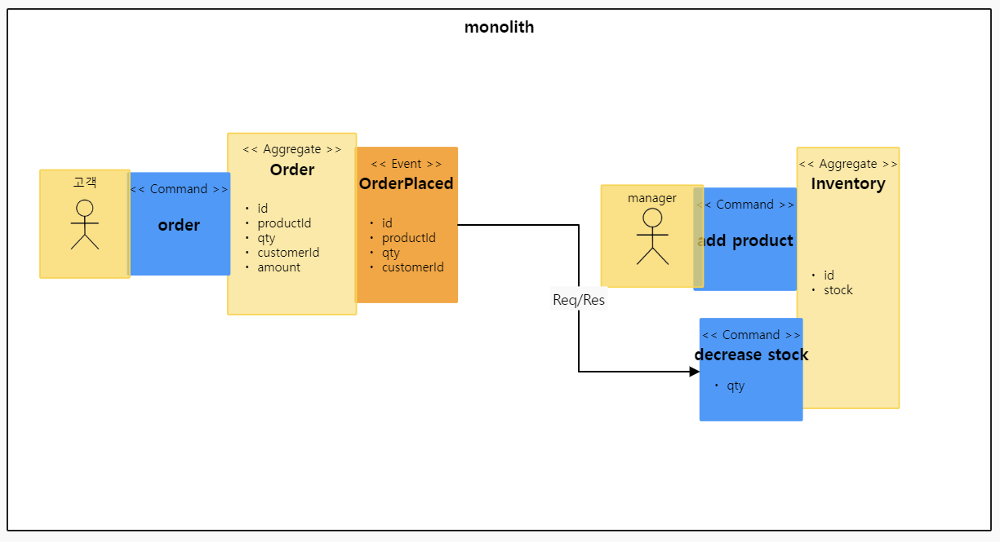

# 단위 마이크로 서비스의 실행 

<div style = "height:400px; object-fit: cover;">
<iframe style = "width:100%; height:100%;" src="https://www.youtube.com/embed/x0hYVpwcl_A" title="YouTube video player" frameborder="0" allow="accelerometer; autoplay; clipboard-write; encrypted-media; gyroscope; picture-in-picture" allowfullscreen></iframe>
</div><br>

단위 마이크로 서비스를 실행하기 위하여 스프링부트를 컴파일하고 실행하는 방법을 실습합니다. 

생성된 애플리케이션은 RESTful 서비스를 제공하고 있으므로 해당 서비스를 httpie tool 을 통하여 호출합니다. 

디버거를 이용하여 동작 구조를 파악하고 어그리거트 객체에 속성을 추가하여 데이터베이스 속성을 추가하여 서비스를 확장합니다.

## 이벤트스토밍 모델 준비

- 아래 모델을 새 탭에서 로딩합니다.
[모델 링크](https://www.msaez.io/#/storming/7b59c53f12e372251cc3c83da8b2fd09)
- 브라우져에 모델이 로딩되지 않으면, 우측 상단의 (사람모양) 아바타 아이콘을 클릭하여 **깃헙(Github)** 계정으로 로그인 후 리로드하면 아래처럼 랩에 필요한 이벤트스토밍 기본 모델이 출력됩니다.   



## 마이크로서비스의 실행

스프링부트로 생성된 마이크로서비스를 컴파일하고 실행합니다.

- 메뉴의 CODE > ProjectIDE 를 선택하여, 연결된 브라우져 IDE를 실행합니다.
- 브라우져 IDE 왼편의 explorer 에서 monolith 폴더를 우클릭 선택한 후 "Open In Integrated Terminal" 을 클릭합니다.
- Terminal 이 해당 폴더 이하에서 열리는 것을 확인합니다.

### 생성된 서비스의 기동
터미널에서 mvn 으로 마이크로서비스 실행하는 방법

```
mvn spring-boot:run
```
<br>

- httpie tool 설치
```
pip install httpie
```
<br>

### 서비스 테스트
- 1번  상품 정보 (재고량)을 등록합니다.

```
http POST localhost:8081/inventories id=1 stock=10
```
<br>

- 주문 1건을 요청합니다.
```
http POST localhost:8081/orders productId=1 productName="TV" qty=3
```
<br>

- 재고량이 3개 감소한 것을 확인합니다.
```
http :8081/inventories/1
```
<br>

- 주문된 상품을 조회합니다.
```java
http GET localhost:8081/orders
```
<br>

- 주문된 상품을 수정합니다.
```java
http PATCH localhost:8081/orders/1 qty=10
```
<br>

## 발생하는 오류 유형
1. **Web server failed to start. Port 8081 was already in use.** : 동일 포트넘버를 사용하는 다른 프로세스를 잡고 있는 서버가 존재. 해당 프로세스를 삭제 (터미널을 닫거나 Ctrl + C 혹은 fuser -k 포트넘버/tcp 명령)
1. **No plugin found for prefix 'spring-boot'**
: 현재 폴더에 pom.xml이 있는지 확인, 있다면 mvn spring-boot:run 명령의 오타확인
1. **ConnectionError: HTTPConnectionPool(host='localhost', port=8081): Max retries**
: 서버 자체가 안뜬 경우

### IDE에서 디버깅
1. Application.java 파일 내 main 함수를 찾습니다.
2. main 함수 내의 첫번째 소스코드 라인의 왼쪽에 동그란 breakpoint 를 찾아 활성화합니다.
3. main 함수 위에 조그만 **Debug** 링크를 클릭합니다.(10초 정도 소요)
4. 잠시후 디버거가 활성화되고, 브레이크 포인트에 실행이 멈춥니다.
5. Continue 라는 화살표 버튼을 클릭하여 디버거를 진행시킵니다.
6. 다음으로, Order.java 의 첫번째 실행지점에 디버그 포인트를 설정합니다:
```java
@PostPersist
    public void onPostPersist() {
        /// 이부분
    }
```
- 주문을 넣어봅니다.
```
http POST localhost:8081/inventories id=1 stock=10

http POST localhost:8081/orders productId=1 productName="TV" qty=3
```
- 위의 Order.java 에 디버거가 멈춤을 확인한후, variables 에서 local > this 객체의 내용을 확인합니다.
<br>

### Order aggregate 확장
- Order.java에 다음 필드를 추가합니다.
```
String address;
```
<br>

### 서비스 재기동
- 추가된 필드를 입력합니다.
```
http POST localhost:8081/orders productId=1 productName="TV" qty=3 address="my home"
```
<br>

### 실행중 프로세스 확인 및 삭제

```java
netstat -lntp | grep :808 
kill -9 <process id>
```
혹은
```
fuser -k 8081/tcp
```
<br> 

#### 상세설명

<div style = "height:400px; object-fit: cover;">
<iframe style = "width:100%; height:100%;" src="https://www.youtube.com/embed/J6yqEJrQUyk" title="YouTube video player" frameborder="0" allow="accelerometer; autoplay; clipboard-write; encrypted-media; gyroscope; picture-in-picture" allowfullscreen></iframe>
</div>
