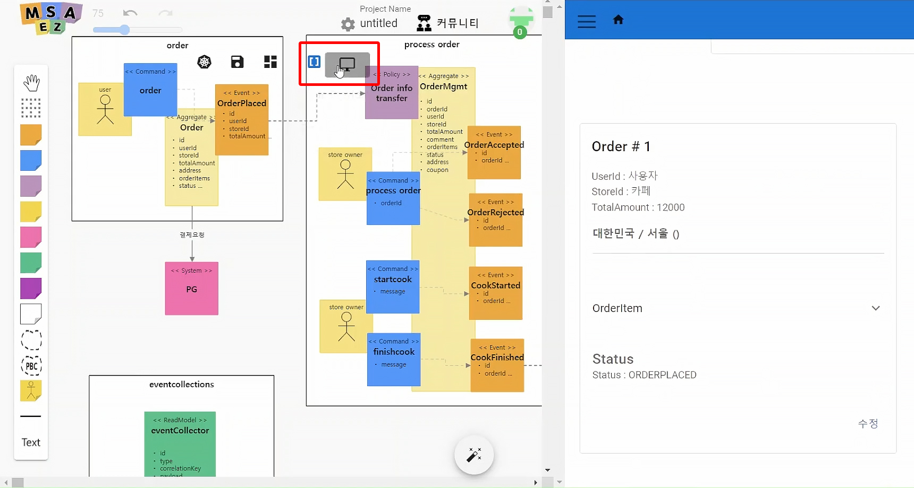
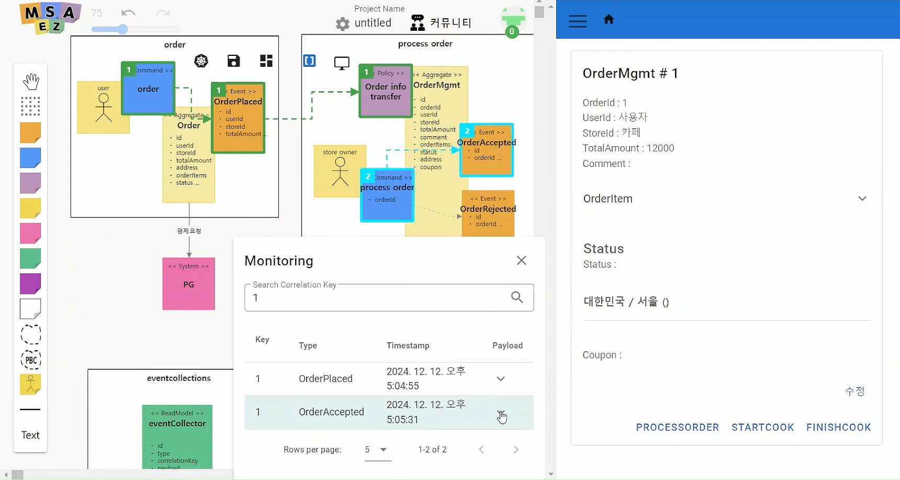
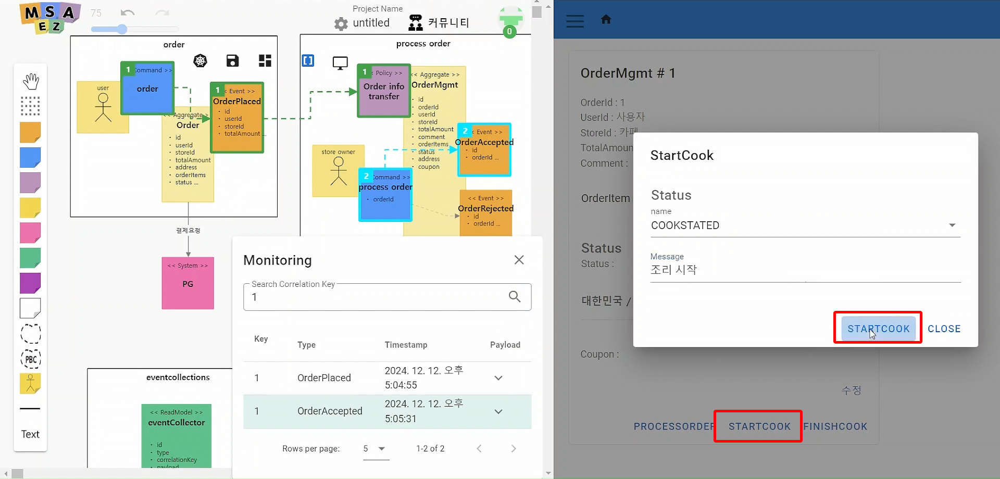
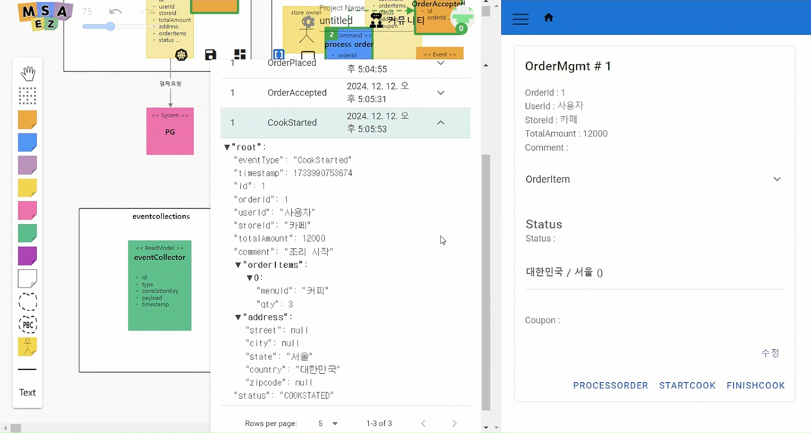
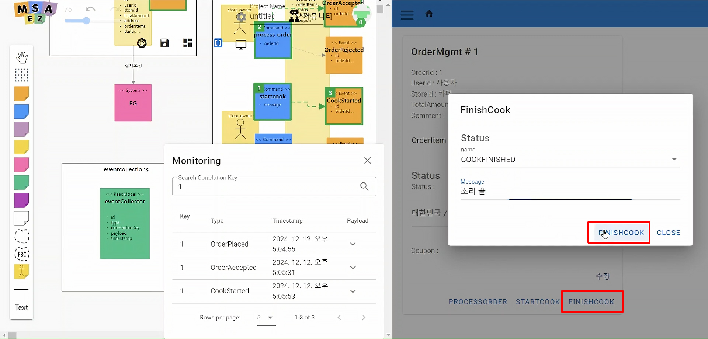

# 이벤트 모니터링

<iframe style = "width:100%; height:100%;" src="https://www.youtube.com/embed/Y3Si5eMNgTM" title="YouTube video player" frameborder="0" allow="accelerometer; autoplay; clipboard-write; encrypted-media; gyroscope; picture-in-picture" allowfullscreen></iframe>

 

## 이벤트 모니터링 기능의 주요 특징

- 실시간으로 업무 단계를 추적할 수 있어 문제 발생 지점을 즉시 파악하여 해결이 훨씬 수월해집니다.
- 새로운 기능을 추가하거나 시스템 수정 후에도 의도한 대로 작동하는지 쉽게 확인할 수 있습니다. 
- 고유 식별 번호(예: 주문번호)를 기준으로 특정 업무에 대한 모든 처리 단계를 한눈에 파악할 수 있습니다. 
- 이벤트 타입, 발생 시간, 상세 내용 등 각 단계별 상세 정보 확인이 가능합니다.

## 수행 방법

### 데모 - 음식 주문 서비스
#### Order(사용자의 주문 관리)
1. Order 관리 -> ORDER 등록 버튼을 눌러서 주문 관리에 관한 정보를 입력하여 등록합니다.

2. 화면 상단의 모니터 아이콘을 눌러 모니터링 기능을 실행시킵니다.

3. 고유식별번호인 Correlation Key를 기준으로 필터링된 이벤트들은 이벤트스토밍 도면에서 진행 상태가 표시됩니다.(도면의 번호는 전체 이벤트의 진행 순서를 표시)

4. 이벤트 목록에서는 이벤트 타입, 이벤트 발생 시간, 이벤트 상세 내용 등을 확인할 수 있습니다.

#### OrderMgmt(주문 내역 상태 관리)
- 동일한 방법으로 등록되는 모든 이벤트들에 대해 추적, 관리가 가능합니다.

##### Process Order

##### Start Cook

##### Finish Cook

