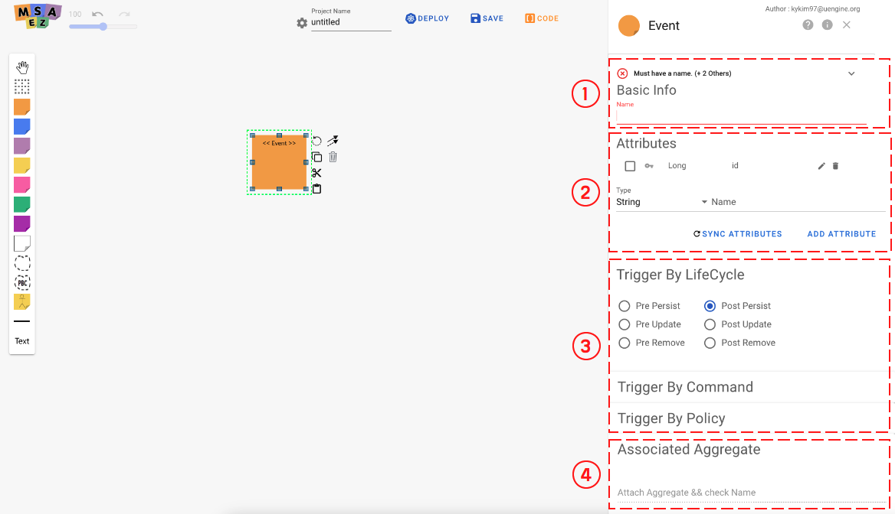
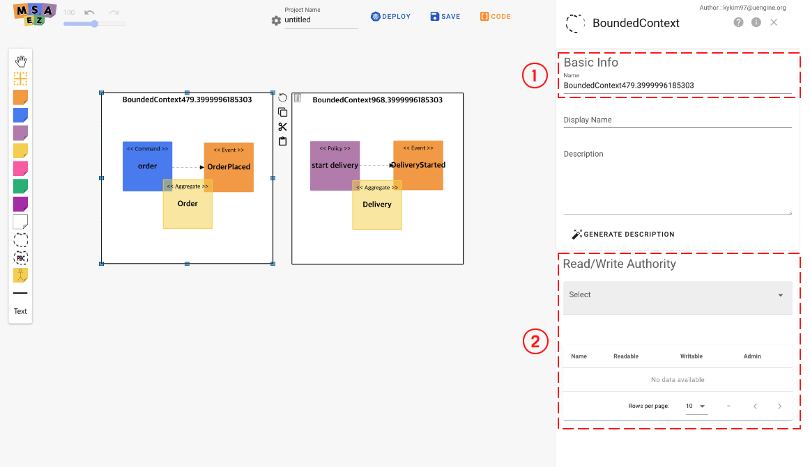

# 이벤트스토밍

<h2>MSAEZ로 마이크로서비스 개발하기</h2>

## 서비스 접속
[MSAEZ](http://www.msaez.io)에 접속합니다. ****크롬 브라우저 추천****

<h2>예제 프로젝트</h2>

예제 프로젝트는 주문 서비스와 배송 서비스 2개의 서비스를 EventStorming하여 Spring-boot로 실행되는 Java Project를 생성하고 이들을 구글클라우드의 쿠버네티스에 자동 배포하는 과정입니다.

### ·	Event Sticker
스티커 팔레트에서 오렌지색 아이콘이 Event를 지칭합니다.

<h4>Event 속성 설정</h4>

추가된 Event 스티커를 더블 클릭하면 오른쪽에 아래와 같이 속성 창이 나타나며, 각 속성 설정에 대한 값은 아래와 같습니다.



|  | 이름                 | 기능 설명                            |
| ---- | -------------------- | ------------------------------------ |
| 1    | Event Name           | Event Sticky note에 작성될 이름      |
| 2    | Attributes            | Event의 Attribute들 등록             |
| 3    | Trigger              | Event를 발생시키는 엔티티의 Trigger  |
| 4    | Associated Aggregates | Event와 연결 될 Aggregate 선택       |

주문팀의 주문 시나리오에 따라 아래와 같이 기입합니다.

1.  Event Name에 **OrderPlaced** 라고 기입합니다.

2.  Trigger는 **PrePersist**를 선택합니다.

3.  Attribute는 Event에서 사용할 Entity를 등록합니다. 기본적으로는 아래의 4. 에서 Aggregate가 연결되면 해당 Aggregate의 Entity정보를 참조합니다.

4.  연결될 Aggregate를 선택합니다. (이후에, Aggregate를 추가한 후에 선택하여 줍니다.)

배송팀은 배송 시나리오에 따라 Event를 생성하여 줍니다.

1.  Event Name에 **DeliveryStarted** 라고 기입합니다.

2.  Trigger는 **PostUpdate**를 선택합니다.

3.  Attribute는 Event에서 사용할 Entity를 등록합니다. 기본적으로는 아래의 4. 에서 Aggregate가 연결되면 해당 Aggregate의 Entity정보를 참조합니다.

4.  연결될 Aggregate를 선택합니다. (이후에, Aggregate를 추가한 후에 선택하여 줍니다.)

### ·	Policy Sticker

스티커 팔레트에서 라일락색 아이콘이 Policy를 지칭합니다.


<h4>Policy 속성 설정</h4>

추가된 Policy 스티커를 더블 클릭하면 오른쪽에 아래와 같이 속성 창이 나타나며, 각 속성 설정에 대한 값은 아래와 같습니다.

|  | 이름                   | 기능 설명                        |
| ---- | ---------------------- | -------------------------------- |
| 1    | Policy Name            | Policy Sticky note에 작성될 이름 |
| 2    | Saga            | Saga 형태의 모델을 그릴 때 중앙 Policy에 설정 |

해당 이벤트가 발생될 때의 업무에 따라서, 아래와 같이 기입합니다.

1.  Policy Name에 “**start delivery**” 라고 기입합니다.


2. Policy 스티커 옆의 화살표 2개 아이콘을 드래그해 ****DeliveryStarted** Event로 연결하여 relation을 생성해줍니다.


### ·	Command Sticker

스티커 팔레트에서 파란색 아이콘이 Command를 지칭합니다.

<h4>Command 속성 설정</h4>

추가된 Command 스티커를 더블 클릭하면 오른쪽에 아래와 같이 속성 창이 나타나며, 각 속성 설정에 대한 값은 아래와 같습니다.


|  | 이름                       | 기능 설명                         |
| ---- | -------------------------- | --------------------------------- |
| 1    | Command Name               | Command Sticky note에 작성될 이름 |
| 2    | Associated Aggregates       | Command와 연결 될 Aggregate 선택  |
| 3    | Method               | Restful API 의 CRUD Type을 선택   |
| 4    | Httpie command usages      | httpie에서 자주 사용 될 명령어 추천   |


해당 이벤트가 발생될 때의 업무에 따라서, 아래와 같이 기입합니다.

1.  Command Name에 “**order**” 라고 기입합니다.

2.  Restful Type은 POST로 설정합니다.

3.  연결될 Aggregate를 선택합니다. (이후에, Aggregate를 추가한 후에 선택하여 줍니다.)


4. Command 스티커 옆의 화살표 2개 아이콘을 드래그해 **OrdePlaced** Event로 연결하여 relation을 생성해줍니다.

### ·	Aggregate Sticker 

Aggregate는 스티커 팔레트에서 노란색 아이콘이 지칭합니다.

<h4>Aggregate 속성 설정</h4>

추가된 Aggregate 스티커를 더블 클릭하면 오른쪽에 아래와 같이 속성 창이 나타나며, 각 속성 설정에 대한 값은
아래와 같습니다.


|  | 이름              | 기능 설명                                      |
| ---- | ----------------- | ---------------------------------------------- |
| 1    | Aggregate Name    | Aggregate Sticky note에 작성될 이름            |
| 2    | Attributes        | Aggregate Entity (Domain Entity)를 정의합니다. |
| 3    | Edit Aggregate Members <br> by Class Diagram       | 클래스 다이어그램으로 Attributes를 정의합니다                       |

주문 서비스의 Aggregate(Domain Entity)를 정의하기 위해, 아래와 같이 기입합니다.

1.  Aggregate Name에 “**Order**” 라고 기입합니다.

2.  Aggregate의 Entity(Domain Entity)를 정의하여 줍니다.  
    해당 서비스에서는 Type은 String인 Name이라는 Entity를 추가하여 줍니다.

배송 서비스의 Aggregate(Domain Entity)를 정의하기 위해, 아래와 같이 기입합니다.

1.  Aggregate Name에 “**Delivery**” 라고 기입합니다.

2.  Aggregate의 Entity(Domain Entity)를 정의하여 줍니다.  
    해당 서비스에서는 Type은 String인 Address라는 Entity를 추가하여 줍니다.

Aggregate를 추가 하였다면 Order는 order Command와 OrderPlaced Event 사이에, 
<br/> Delivery는 start delivery Policy와 DeliveryStarted Event 사이에 각각 위치시킵니다.

### ·	Bounded Context Sticker

Bounded Context는 스티커 팔레트에서 점선 모양의 아이콘이 지칭합니다.

<h4>Bounded Context 속성 설정</h4>



|  | 이름                            | 기능 설명                     |
| ---- | ------------------------------- | ----------------------------- |
| 1    | Bounded Context Name            | Bounded Context에 작성될 이름 |
| 2    | Bounded Context Authority       | Bounded Context의 권한을 부여할 유저 선택과 권한 부여 |

주문 서비스의 Bounded Context와 배송 서비스의 Bounded Context를 그린 후, 각각의 서비스에 맞게 EventStorming의 Sticky Note들을 각 Bounded Context에 Drag & Drop으로 넣어줍니다.

각 Bounded Context들의 name은 Order, Delivery로 입력해줍니다.

### ·	Relation

Relation은 Event 스티커에서 Policy 스티커로 연결되는 선을 지칭합니다.

<h4>마이크로서비스 간 Relation 추가</h4>

Event 스티커에서 화살표 모양 아이콘을 선택 또는 Drag 하여 연결될 Policy 스티커를 선택 또는 Drop하면 연결됩니다.


<h4>Relation 속성 설정</h4>


|  | 이름 | 기능 설명                                                                                                                   |
| ---- | -----| --------------------------------------------------------------------------------------------------------------------------- |
| 1    | Type | Event-Driven형식의 Pub/Sub 방식을 사용할 것인지, <br />또는 Request & Response 방식의 Restful API 방식을 사용할 것인지 설정 |

주문 서비스의 OrderPlaced의 이벤트가 발생할 경우 start delivery가 시작되도록 연결하되
<br />어떠한 방식으로 start delivery를 시작하게 할 것인지를 설정하여 줍니다.

1.  Event-Driven 방식의 Pub/Sub 방식으로 설정하여 줍니다.

<h4>EventStorming 결과</h4>

상기 작성된 작업들을 완료하면 아래와 같은 형태의 EventStorming 결과물이 나옵니다.


### ·	Code Preview

Code Preview를 선택하면 EventStorming 모델을 기반으로 생성된 소스코드를 확인 할 수 있습니다.

<h4>코드 프리뷰 레이아웃</h4>


|  | 이름               | 기능 설명                                                                            |
| -- | -------------------- | ------------------------------------------------------------------------------------ |
| 1 | Menu Panel | Git 연동, 템플릿 수정, 파일 다운로드 등의 기능 사용 가능 |
| 2 | Source Tree | 모델을 기반으로 생성된 전체 파일리스트 표시 |
| 3 | Source Code | 선택한 파일의 소스코드 표시 |
| 4 | Topping | Java/Spring Version, Security - Token based Authentication,<br> Kubernetes/Service Mesh등 설정 |

<h4>Menu Panel 상세</h4>


|  | 이름                | 기능 설명                                                              |
|------|---------------------|----------------------------------------------------------------------- |
| 1    &nbsp;| Push to Git | 사용자의 GitHub 계정과 연결해 레포지토리 생성 및 GitPod IDE 연동 |
| 2    &nbsp;| Edit Template | 적용된 템플릿 파일을 직접 수정 |
| 3    &nbsp;| Design Patterns |  |
| 4    &nbsp;| Download Archive | 전체 소스코드를 로컬 파일로 다운로드 |
| 5    &nbsp;| Search | 파일명 검색 기능 활성화 |
| 6    &nbsp;| Diff Mode | 사용자가 원본 코드를 수정하면 수정본의 변경사항을 표시 |
| 7    &nbsp;| Explain Project | 프로젝트에 대한 설명 제시 |

## 빌드

### ·	파일 구조 설명

  - Bounded Context 에 설정한 이름별(Order, Delivery)로 프로젝트가 생성되고, 아래와 같은 구조를 가집니다.

  - 

  - gateway 는 기본 제공되는 템플릿으로 spring-cloud-gateway를 설정하는 방법을 나타내고 있습니다.
    정상적으로 사용시에는 gateway/src/main/resource 의 application.yaml
    파일에서 routes 부분을 수정하여 사용하여야 합니다.

  - 파일 구조는 아래와 같이 스티커별로 기본 템플릿에 의하여 생성됩니다. spring-boot 기반의 프로젝트 이며, maven 으로 리소스 관리를 합니다. 파일 생성 위치나, 파일 안의 기본 내용을 생성시마다 변경을 하려면 다음 장의 커스텀 템플릿을 활용하면 됩니다.


  - application.yaml
    
      - spring-boot 의 설정 파일이며, local 환경 변수와 Docker용 환경변수를 profile 설정으로
        분리했습니다.
    
      - 이벤트 기반이기 때문에 메시지 처리를 위하여 spring-cloud-stream 라이브러리를 사용합니다. 그 중에서
        브로커를 kafka 를 사용하여 설정되어 있습니다.

  - Dockerfile
    
      - Docker image 를 생성할 때 필요한 파일입니다.
    
      - Docker 로 build 시 "--spring.profiles.active=docker" 로 설정되어 있어서
        application.yaml 파일에서 설정한 프로파일을 읽게 됩니다.

### ·	GitPod Cloud IDE 연동


Code Preview의 Menu Panel에서 Push to Git 버튼을 클릭하면 나오는 다이얼로그의 Create 버튼을 클릭해 본인 GitHub 계정에 New Repository를 생성합니다.


Repository 생성이 완료되면 초록색 success 알림창이 뜨고, Repo 주소 옆에 있는 버튼을 클릭하면 해당 레포지토리로 이동해 프로젝트가 생성된 것을 확인할 수 있습니다.


<p align="center">생성된 Git Repository 화면</p>


Repository 생성 완료가 확인되면 IDE 탭으로 이동해 Open GitPod 버튼을 클릭해 GitPod Cloud IDE를 실행시킵니다.


GitPod에 접근하면 위와 같은 시작 페이지가 나오고, Continue 버튼을 클릭해 작업을 이어가줍니다.


별도의 설치 없이 웹 브라우저 기반으로 로컬 IDE를 운용할 수 있는 GitPod Cloud IDE에 이벤트스토밍을 통해 생성된 코드가 잘 넘어온 것을 확인할 수 있습니다.

<h4>선행사항</h4>

  - maven 설치
  - local kafka 실행 – localhost:9092

### ·	실행

  - 메이븐 프로젝트이기 때문에 mvn spring-boot:run 으로 실행을 합니다.

  - 정상적으로 실행이 되었다면 브라우저에 localhost:8081 (port 는 프로젝트별로 다르기 때문에 설정파일 참조)
    을 적어보면 Aggregate 에 설정하였던 속성값들이 HATEOAS 수준으로 정상적으로 나오는지를 확인합니다.

  - Command 에 작성하였던 get, post 등의 메서드가 정상적으로 호출되는지 확인합니다.

### ·	클라우드 배포

이번 가이드항목은 작동하는 소스코드를 github 에 올리고 GCB 트리거를 생성하여 자동 빌드되고 배포되는 방법을 guide
합니다.

### ·	Git 연동

  - GCB 는 git repository 를 현재까지 github, google code, bitbucket 을 지원합니다. 본
    가이드는 이중에서 github 에 코드를 넣는 방법을
    설명합니다.

  - [<span class="underline">https://github.com/</span>](https://github.com/)
    에서 레파지토리를 생성합니다.

  - 레파지토리를 생성 하고 git 주소가 생성이 됩니다

  - github 에 올리려는 프로젝트에서 아래와 같은 스크립트를 실행하여 github 에 source 를 push 합니다.

  - git init

  - git commit –m ‘commit message’ .

  - git push \<github 주소\>

### ·	GCB Trigger 생성

GCB 트리거 생성은 아래와 같은 순서대로 진행을
합니다.
<br>

1. GCP 의 GCB 메뉴로 들어가서 트리거 메뉴를 클릭합니다.  

<br><br><br>

2. 상단의 저장소 연결 버튼을 클릭합니다.

<br>

3. 저장소 선택에서 github을 선택합니다.

<br><br><br>

4. 깃헙 인증을 하여 진행합니다.

<br><br><br>

5. 연결할 프로젝트를 선택하여 저장소 연결을 마무리 합니다.

<br><br><br>

6. 상단의 트리거 생성 버튼을 클릭하여 트리거를 생성합니다.

<br><br><br>

7. 트리거 생성 화면의 하단에 빌드 구성을 CloudBuild 로 선택합니다.
>
<br><br><br>

8. 트리거 만들기 버튼을 클릭하여 트리거생성을 완료합니다. 오른쪽의 트리거 실행버튼으로 바로 트리거 실행을 할 수 있습니다. 

<br><br><br>

위와 같이 트리거를 생성하였으면, github 에 push 명령을 실행할 때마다, 트리거가 작동하는 것을 확인 할 수 있습니다.

### ·	쿠버네티스 배포

<h4>쿠버네티스 배포 확인</h4>

  - 트리거가 정상적으로 실행을 하였으면 기록 메뉴에서 빌드 성공/실패 여부를 확인 할 수있습니다.


  - 빌드 기록에 녹색으로 성공화면이 떠있으면 GKE 에 성공적으로 배포가 된 것이다. GKE 메뉴의 작업 부하 항목에서 현재
    동작하는 서비스를 확인 할 수
있습니다.


### ·	배포 실패시 해결방법

* 빌드 실패시 기록 항목에서 아래와 같이 빨간색으로 빌드 실패가 나타나고, 클릭시 어떤 step 에서 에러가 났는지 확인이 가능하다. 로그 다운로드 버튼을 눌러서 상세 로그를 확인하면서 해결이 가능하다.


* deploy 단계에서 에러가 났을 경우 첫번째로 GCB 에서 GKE 로 배포를 하는 권한이 있는지 체크해 보고, 없을 때 권한 설정을 해줍니다.

Cloud빌드 – 설정 메뉴에서 Kubernetes Engine 개발자가 사용설정됨 으로 상태가 보이는지 확인하고,
안되어있을시 사용 설정합니다.


* cloudBuild.yaml 파일의 option 부분에 클러스터 Zone 과 이름이 일치하는지 확인 합니다.

```css
options :  
    env:  
    ## location/name of GKE cluster (used by all kubectl commands)  
    - CLOUDSDK_COMPUTE_ZONE=asia-northeast1-a  
    - CLOUDSDK_CONTAINER_CLUSTER=standard-cluster-1
```
