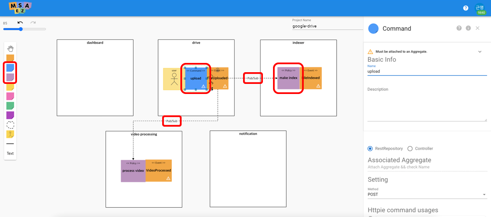
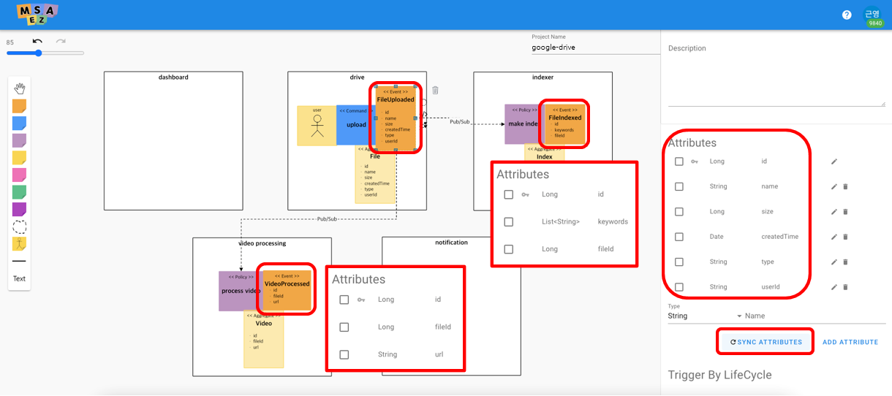
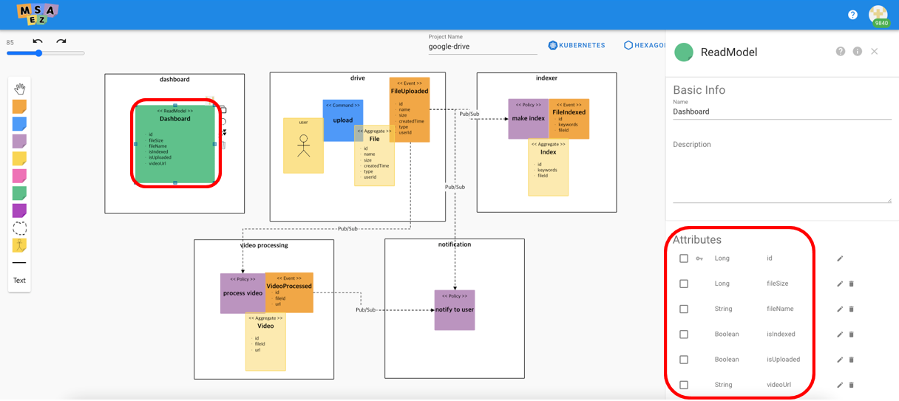
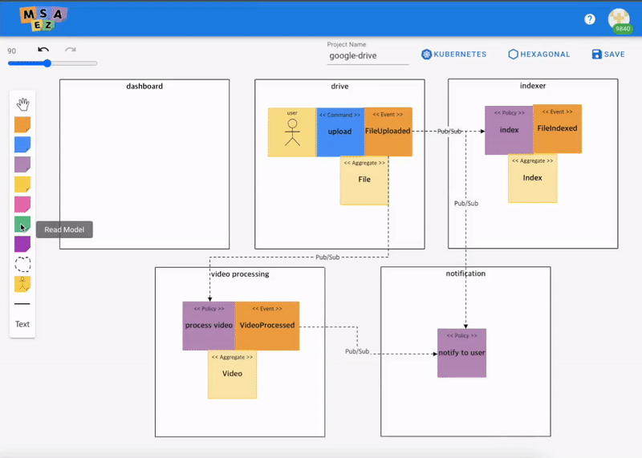
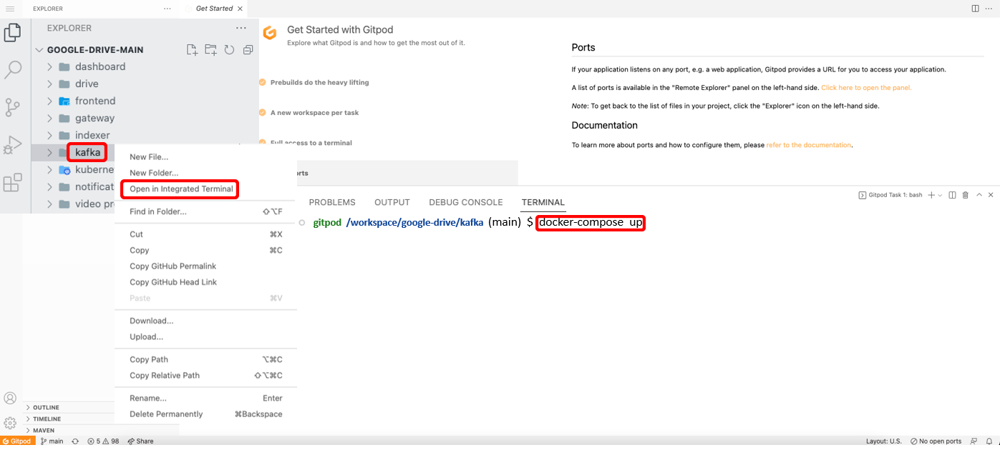
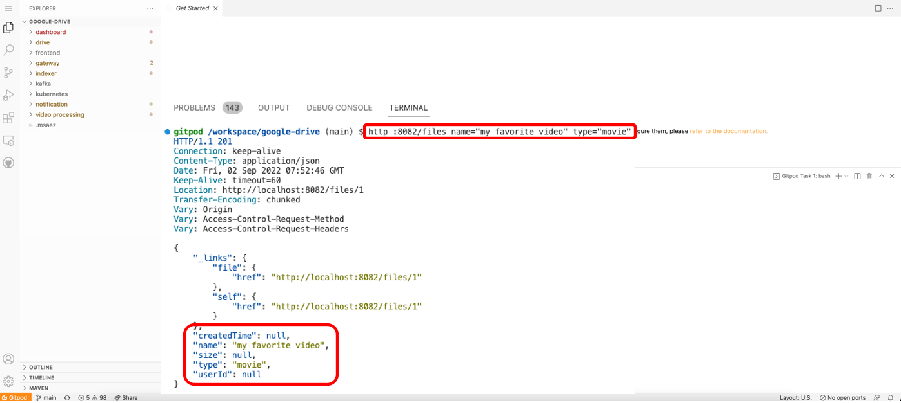

# 구글 드라이브 예제

<h2>마이크로서비스 기반 구글 드라이브 서비스 개발하기</h2>

## 실습도구 접속
[labs.msaez.io](http://labs.msaez.io) 에 접속합니다.
 (크롬 브라우저 추천)

## 시나리오

1. 사용자가 파일을 업로드한다.
 
2. 파일이 업로드 될 때마다 파일의 위치를 파일 이름으로 인덱싱한다.
 
3. 업로드된 파일이 비디오인 경우, 파일을 비디오 스트리밍 처리한다 (결과는 비디오 스트림 서비스 접속 url).
 
4. 파일이 업로드 될때와 비디오로 생성되었을 때, 파일을 업로드한 유저에게 노티가 된다.
 
5. 대시보드에서는 업로드 시킨 파일의 상태 (파일사이즈, 파일명, 인덱싱여부, 업로드여부, 비디오url) 가 표시된다.

서비스 구현에 필요한 바운디드 컨텍스트 목록 : 
 
1. dashboard
2. drive
3. indexer
4. video processing
5. notification

## Instructions

### 모델링

<h4>1. EventStorming Model 생성</h4>

> 

위에서 접속한 labs.msaez.io 에서 아래로 스크롤하면 MODELING TOOLS 종류들이 나옵니다. 

이 중 EventStorming Model의 CREATE 버튼을 클릭해 새 모델을 하나 생성해줍니다.

<h4>2. Bounded Context 구분</h4>

> 

> 

우선 구글 드라이브 서비스가 총 5개의 마이크로서비스로 구성된다고 가정하고, 단위 마이크로서비스의 범위를 설정해주는 바운디드 컨텍스트를 총 5개 만들어줍니다.

각 바운디드 콘텍스트의 명칭은 위에서 언급한대로 dashboard, drive, indexer, video processing, notification으로 설정해줍니다.

<h4>3. Event(오렌지 스티커) 도출</h4>

> 

> 

제시된 시나리오를 바탕으로 각 마이크로서비스에서 산출될 결과물을 오렌지색의 'Event' 스티커로 나타내줍니다.

첫 번째 시나리오인 "사용자가 파일을 업로드한다." 라는 이벤트가 'drive' 마이크로서비스를 통해 실행된다고 보면 여기서 도출될 이벤트는 'FileUploaded'로 이름 붙이는 게 좋겠습니다.

두 번째 시나리오인 "파일이 업로드 될 때마다 파일의 위치를 파일 이름으로 인덱싱한다." 라는 이벤트는 바운디드 컨텍스트 'indexer' 내에서 처리되는 것이 적합할 것 같습니다. 이벤트의 명칭은 'FileIndexed'로 설정해줍니다.

세 번째 시나리오인 "업로드된 파일이 비디오인 경우, 파일을 비디오 스트리밍 처리한다." 를 처리할 바운디드 컨텍스트는 'video processing'입니다. 그 안에 이벤트로 'VideoProcessed'를 넣어줍니다.

유저에게 노티를 주고 업로드한 파일을 조회하는 4, 5번째 시나리오는 이벤트로 나타내기에 적합하지 않으므로, 우선 저희가 만들 구글 드라이브 서비스에서는 크게 위와 같은 3가지의 이벤트가 발생한다고 보겠습니다.

<h4>4. Event 에 대한 Input 추가</h4>

> 

> 

이벤트 스티커를 모두 적용했다면 해당 이벤트를 발생시키는 액션, 즉 input을 설정해줘야 합니다. 여기서 사용되는 스티커는 파란색 스티커인 'Command'와 라일락색 스티커인 'Policy'이며, 모든 액션은 이벤트와 연결되도록 배치해줍니다.

커맨드와 폴리시의 차이점은 해당 액션의 주체에 있습니다. 유저가 직접 행하는 액션은 커맨드로, 시스템에서 자동으로 실행되는 액션은 폴리시로 설정해줍니다.

즉 첫 번째 시나리오인 "사용자가 파일을 업로드한다." 는 유저가 직접 파일을 시스템에 업로드하는 액션을 수반하므로 파란색 커맨드 스티커로 표현해주고, 명칭은 간단하게 'upload' 만 적어줍니다. 
그 옆에 스틱맨이 그려진 'Actor' 스티커를 붙여 액션의 주체를 표현해주면 모델의 이해도가 더욱 높아집니다.

반면 2, 3번째 시나리오는 유저가 파일을 업로드한 후 시스템에서 자동으로 해당 파일을 인덱싱해주고 비디오 여부를 판단해 스트리밍 처리를 하는 것이므로, 폴리시 스티커를 적용하는 것이 적합합니다. 
'FileIndexed'에 대한 액션은 'make index', 'VideoProcessed'에 대한 액션은 'process video'로 각각 넣어줍니다.

또한 유저가 파일을 업로드하는 이벤트가 완료되어야 그 다음 단계인 파일 인덱싱과 비디오 스트리밍이 진행되므로, pub/sub 라인을 'FileUploaded' 이벤트에서 'make index'와 'process video'로 각각 연결해줍니다.

여기서 pub/sub은 publish/subscribe의 약자로, publish된 이벤트를 폴리시 측에서 subscribe해 그 다음 이벤트가 실행되도록 해주는 것입니다.

<h4>5. Aggregate(노란색 스티커) 속성 추가</h4>

> 

> 

여기까지 작업을 마쳤다면, 보드 왼쪽에 위치한 스티커 팔레트의 배치 순서대로 본 튜토리얼이 진행되고 있다는 것을 알 수 있습니다. 

그렇다면 다음 순서는 커맨드와 폴리시 아래에 있는 노란색 스티커, "Aggregate"가 되겠죠. 

어그리거트는 모든 액션(input)과 이벤트(output) 사이에 위치하며, 해당 액션과 이벤트로부터 얻어지는 데이터를 표현할 수 있는 대표단어를 찾아 이름으로 지정해줍니다. 

drive 측에서 얻을 수 있는 가장 대표적인 데이터는 유저가 업로드한 파일이므로, 'File'을 이름으로 넣어줍니다.

indexer와 video processing 측에 위치한 어그리거트의 이름은 비교적 쉽게 도출됩니다. 파일을 업로드했을 때 진행된 인덱싱 작업의 결과물인 'Index'와 스트리밍 작업의 결과물인 'Video'를 각각의 이름으로 넣어주면 됩니다.

이렇게 3개의 어그리거트를 선언해준 후에는, 각각의 속성 정보를 입력해줘야 합니다. 여기서 입력한 속성 정보는 차후 이벤트스토밍 모델을 토대로 코드를 생성할 때 사용됩니다. 

어그리거트 스티커를 더블클릭해 'Attributes' 부분을 보면 이미 Long 타입의 id가 기본 속성으로 선언되어 있는 것을 볼 수 있습니다. 여기에 부가적인 속성을 추가하는 작업이 필요합니다.

> 

가장 먼저 File의 속성을 정의해보겠습니다. 

평소에 로컬이나 서버에 파일을 업로드할 때 표기되는 값들을 생각하면 작업이 편합니다. 파일의 이름(name), 크기(size), 생성일(createdTime), 형식(type), 소유자(userId)를 적절한 데이터 타입과 함께 추가해줍니다.

String은 문자열, Integer는 4바이트의 기본 숫자열, Long은 Integer보다 큰 8바이트 용량의 숫자열, Date는 날짜를 표시해주는 데이터 타입입니다. 

업로드된 파일의 속성을 모두 정의해준 후에는 인덱싱 및 비디오 스트리밍 작업의 결과에 대한 속성까지 추가해주면 이번 스텝이 마무리됩니다.

두 결과물 모두 업로드한 파일을 기반으로 생성되므로 고유의 키값인 id 외에 파일을 식별하기 위한 'fileId'가 들어가야 하고, Index의 경우에는 파일의 이름으로 인덱싱된 'keyword', Video는 스트리밍 서비스로 접속 가능한 'url'을 추가로 설정해줍니다. 여기서 keyword의 경우 여러 개가 나올 수 있으므로, List 타입의 String으로 설정해줍니다.

<h4>6. Event 속성 추가</h4>

> 

> 

어그리거트에 필요한 속성 정보를 추가했다면, pub/sub 기능을 활성화해주기 위해 이벤트 쪽에도 동일한 정보를 입력해줘야 합니다. 

이벤트 스티커를 더블클릭하면 어그리거트와 동일한 'Attributes' 영역이 있고, 그 아래에 Sync Attributes 버튼이 있습니다. 이 버튼을 클릭하면 해당 이벤트와 연결된 어그리거트에 등록된 속성 정보들이 복제됩니다.

이와 같은 방식으로 앞서 도출한 3개의 이벤트에 대한 속성 정보를 추가해주면 됩니다.

<h4>7. notification Policy 추가</h4>

> 

> 

유저에게 노티를 주는 기능은 간단하게 폴리시 하나를 선언해줌으로써 구현 가능합니다.

'notify to user' 라는 이름의 폴리시를 'notification' 바운디드 컨텍스트에 넣어주고, 해당 액션이 실행되기 위한 pub/sub 라인을 그려줍니다.

시나리오에서는 "파일이 업로드 될때와 비디오로 생성되었을 때, 파일을 업로드한 유저에게 노티가 된다." 라고 했으므로, FileUploaded 와 VideoProcessed 이벤트가 퍼블리시 되었을 때 해당 폴리시가 실행되도록 설정해줍니다.

<h4>8. ReadModel(초록색 스티커) 속성 추가</h4>

> 

> 

마지막 시나리오에 등장하는 파일의 상태를 표시하는 대시보드는 초록색 스티커인 "ReadModel"로 나타내줍니다. 리드모델에서 설정해주는 CQRS는 서비스 운용에 큰 역할을 하게 됩니다.

우선 남아있는 바운디드 콘텍스트인 dashboard에 리드모델을 하나 추가하고 이름은 "Dashboard"로 선언해줍니다.

그리고 여기서도 속성 정보를 추가해야 하는데, 시나리오에서 제시된 대시보드 상에서 나타내야 할 요소들(파일사이즈, 파일명, 인덱싱여부, 업로드여부, 비디오url)을 추가해줍니다.

<h4>9. ReadModel CREATE WHEN 추가</h4>

> 

> 

<h4>10. ReadModel UPDATE WHEN 추가</h4>

> 

> 

> 

<h4>12. 완성된 모델로부터 도출된 코드 확인</h4>

> 

<h4>13. git repository 연동</h4>

> 

<h4>14. gitpod IDE 실행</h4>

> 

> 

### 프로젝트 실행

<h4>15. drive 서비스 실행</h4>

> 

<h4>16. kafka 실행</h4>

> 

<h4>17. httpie 설치</h4>

> 

<h4>18. httpie tool 작동 테스트</h4>

> 

<h4>19. index 코드 수정 및 서비스 실행</h4>

> 

<h4>20. 테스트용 파일 업로드</h4>

> 

<h4>21. 업로드된 파일에 대한 indexer 작동 확인</h4>

> 

<h4>22. video 코드 수정 및 서비스 실행</h4>

> 

<h4>23. 업로드된 파일에 대한 video processing 작동 확인</h4>

> 

<h4>24. dashboard 서비스 실행 및 내역 조회</h4>

> 

<h4>25. 프론트엔드 서버 실행</h4>

> 

### 웹 어플리케이션 활용 

<h4>26. 홈 화면</h4>

> 

<h4>27. 대시보드 조회</h4>

> 

<h4>28. 업로드된 파일 목록 조회 + 파일 추가</h4>

> 

<h4>29. 파일 추가 상세</h4>

> 

<h4>30. 새로 업로드한 파일 조회</h4>

> 

<h4>31. 새로 업로드한 파일 index 여부 확인</h4>

> 

<h4>32. 새로 업로드한 파일 video processing 여부 확인</h4>

> 