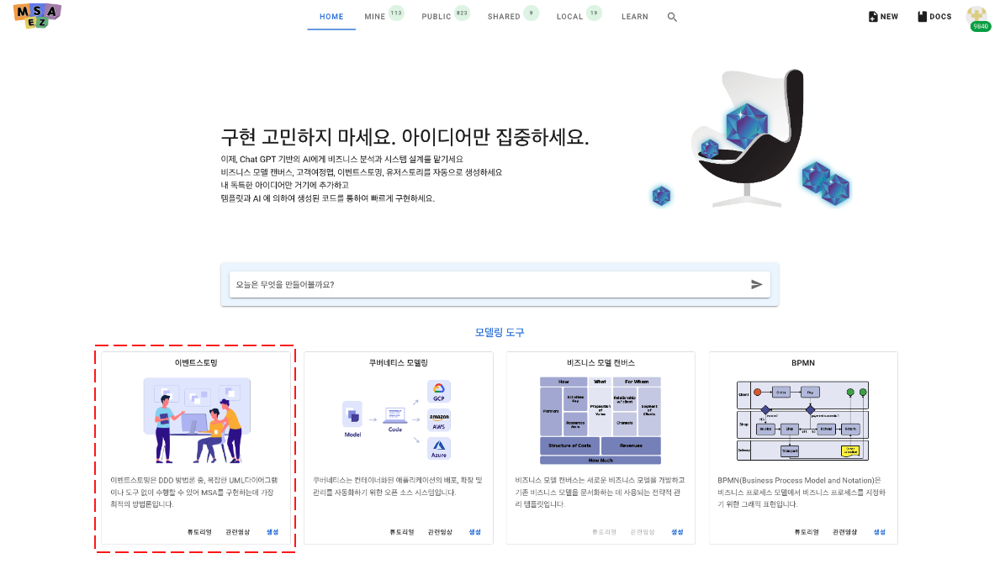
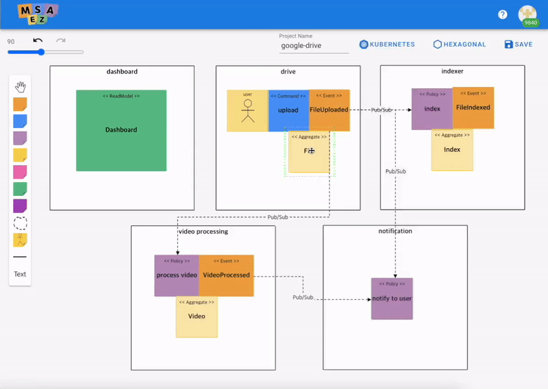
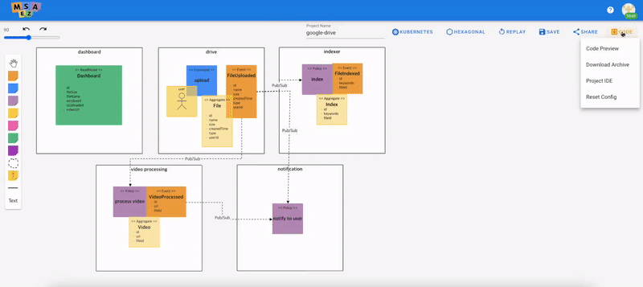
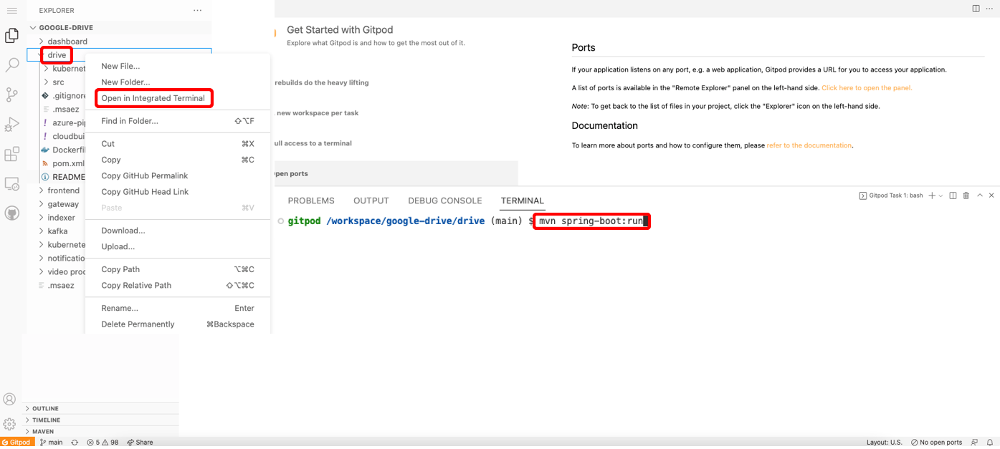
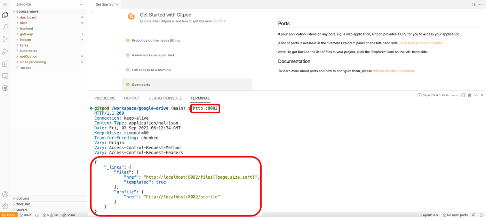
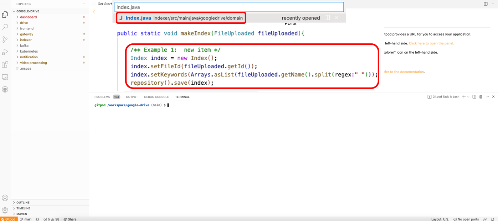
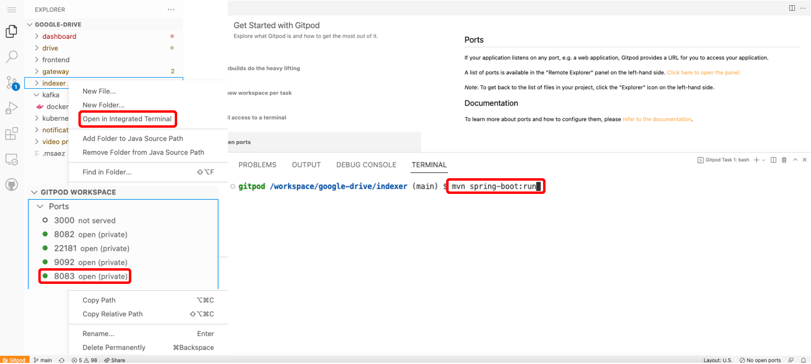
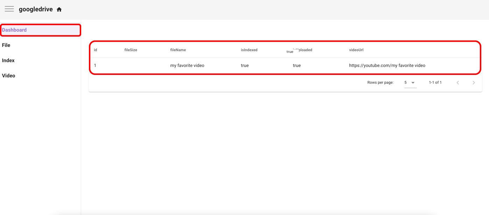
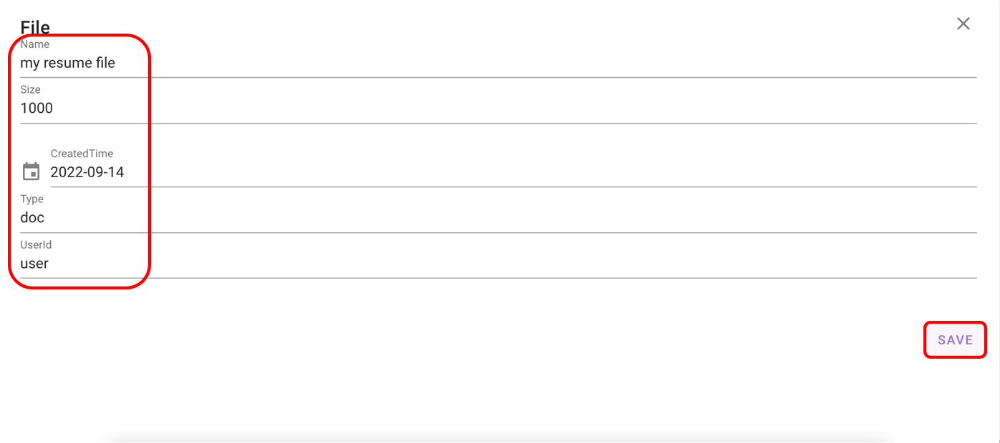

# Quick Start

'구글드라이브 서비스' 예제 시나리오를 기반으로 MSAEZ를 활용해 분석/설계에서 구현, 배포에 이르는 마이크로서비스의 전 과정을 구현합니다. 이로써, 여러분들은 MSAEZ가 각 단계에서 어떻게 사용되고 활용되어지는 지를 한눈에 파악할 수 있습니다.

구글드라이브 서비스의 예시 시나리오는 다음과 같습니다.

## 실습도구 접속
[MSAEZ](http://www.msaez.io)에 접속합니다. ****크롬 브라우저 추천****

## 시나리오

1. 사용자가 파일을 업로드한다.
 
2. 파일이 업로드 될 때마다 파일의 위치를 파일 이름으로 인덱싱한다.
 
3. 업로드된 파일이 비디오인 경우, 파일을 비디오 스트리밍 처리한다 (결과는 비디오 스트림 서비스 접속 url).
 
4. 파일이 업로드 될때와 비디오로 생성되었을 때, 파일을 업로드한 유저에게 노티가 된다.
 
5. 대시보드에서는 업로드 시킨 파일의 상태 (파일사이즈, 파일명, 인덱싱여부, 업로드여부, 비디오url) 가 표시된다.

서비스 구현에 필요한 바운디드 컨텍스트 목록 : 
 
1. dashboard
2. drive
3. indexer
4. video processing
5. notification

## Instructions

### 모델링

<h4>1. EventStorming Model 생성</h4>



위에서 접속한 labs.msaez.io 에서 아래로 스크롤하면 모델링 도구 종류들이 나옵니다. 

이 중 이벤트스토밍의 생성 버튼을 클릭해 새 모델을 하나 생성해줍니다.

<h4>2. Bounded Context 구분</h4>


우선 구글 드라이브 서비스가 총 5개의 마이크로서비스로 구성된다고 가정하고, 단위 마이크로서비스의 범위를 설정해주는 바운디드 컨텍스트를 총 5개 만들어줍니다.

각 바운디드 콘텍스트의 명칭은 위에서 언급한대로 dashboard, drive, indexer, video processing, notification으로 설정해줍니다.

<h4>3. Event(오렌지 스티커) 도출</h4>


제시된 시나리오를 바탕으로 각 마이크로서비스에서 산출될 결과물을 오렌지색의 'Event' 스티커로 나타내줍니다.

첫 번째 시나리오인 "사용자가 파일을 업로드한다." 라는 이벤트가 'drive' 마이크로서비스를 통해 실행된다고 보면 여기서 도출될 이벤트는 'FileUploaded'로 이름 붙이는 게 좋겠습니다.

두 번째 시나리오인 "파일이 업로드 될 때마다 파일의 위치를 파일 이름으로 인덱싱한다." 라는 이벤트는 바운디드 컨텍스트 'indexer' 내에서 처리되는 것이 적합할 것 같습니다. 이벤트의 명칭은 'FileIndexed'로 설정해줍니다.

세 번째 시나리오인 "업로드된 파일이 비디오인 경우, 파일을 비디오 스트리밍 처리한다." 를 처리할 바운디드 컨텍스트는 'video processing'입니다. 그 안에 이벤트로 'VideoProcessed'를 넣어줍니다.

유저에게 노티를 주고 업로드한 파일을 조회하는 4, 5번째 시나리오는 이벤트로 나타내기에 적합하지 않으므로, 우선 저희가 만들 구글 드라이브 서비스에서는 크게 위와 같은 3가지의 이벤트가 발생한다고 보겠습니다.

<h4>4. Event 에 대한 Input 추가</h4>


이벤트 스티커를 모두 적용했다면 해당 이벤트를 발생시키는 액션, 즉 input을 설정해줘야 합니다. 여기서 사용되는 스티커는 파란색 스티커인 'Command'와 라일락색 스티커인 'Policy'이며, 모든 액션은 이벤트와 연결되도록 배치해줍니다.

커맨드와 폴리시의 차이점은 해당 액션의 주체에 있습니다. 유저가 직접 행하는 액션은 커맨드로, 시스템에서 자동으로 실행되는 액션은 폴리시로 설정해줍니다.

즉 첫 번째 시나리오인 "사용자가 파일을 업로드한다." 는 유저가 직접 파일을 시스템에 업로드하는 액션을 수반하므로 파란색 커맨드 스티커로 표현해주고, 명칭은 간단하게 'upload' 만 적어줍니다. 
그 옆에 스틱맨이 그려진 'Actor' 스티커를 붙여 액션의 주체를 표현해주면 모델의 이해도가 더욱 높아집니다.

반면 2, 3번째 시나리오는 유저가 파일을 업로드한 후 시스템에서 자동으로 해당 파일을 인덱싱해주고 비디오 여부를 판단해 스트리밍 처리를 하는 것이므로, 폴리시 스티커를 적용하는 것이 적합합니다. 
'FileIndexed'에 대한 액션은 'make index', 'VideoProcessed'에 대한 액션은 'process video'로 각각 넣어줍니다.

또한 유저가 파일을 업로드하는 이벤트가 완료되어야 그 다음 단계인 파일 인덱싱과 비디오 스트리밍이 진행되므로, pub/sub 라인을 'FileUploaded' 이벤트에서 'make index'와 'process video'로 각각 연결해줍니다.

여기서 pub/sub은 publish/subscribe의 약자로, publish된 이벤트를 폴리시 측에서 subscribe해 그 다음 이벤트가 실행되도록 해주는 것입니다.

<h4>5. Aggregate(노란색 스티커) 속성 추가</h4>


여기까지 작업을 마쳤다면, 보드 왼쪽에 위치한 스티커 팔레트의 배치 순서대로 본 튜토리얼이 진행되고 있다는 것을 알 수 있습니다. 

그렇다면 다음 순서는 커맨드와 폴리시 아래에 있는 노란색 스티커, "Aggregate"가 되겠죠. 

어그리거트는 모든 액션(input)과 이벤트(output) 사이에 위치하며, 해당 액션과 이벤트로부터 얻어지는 데이터를 표현할 수 있는 대표단어를 찾아 이름으로 지정해줍니다. 

drive 측에서 얻을 수 있는 가장 대표적인 데이터는 유저가 업로드한 파일이므로, 'File'을 이름으로 넣어줍니다.

indexer와 video processing 측에 위치한 어그리거트의 이름은 비교적 쉽게 도출됩니다. 파일을 업로드했을 때 진행된 인덱싱 작업의 결과물인 'Index'와 스트리밍 작업의 결과물인 'Video'를 각각의 이름으로 넣어주면 됩니다.

이렇게 3개의 어그리거트를 선언해준 후에는, 각각의 속성 정보를 입력해줘야 합니다. 여기서 입력한 속성 정보는 차후 이벤트스토밍 모델을 토대로 코드를 생성할 때 사용됩니다. 

어그리거트 스티커를 더블클릭해 'Attributes' 부분을 보면 이미 Long 타입의 id가 기본 속성으로 선언되어 있는 것을 볼 수 있습니다. 여기에 부가적인 속성을 추가하는 작업이 필요합니다.



가장 먼저 File의 속성을 정의해보겠습니다. 평소에 로컬이나 서버에 파일을 업로드할 때 표기되는 값들을 생각하면 작업이 편합니다.

<h4>File</h4>

| Type  | Name  |
|---|---|
| Long  | id  |
| String  | name  |
| Long  | size  |
| Date  | createdTime  |
| String  | type  |
| String  | userId  |

String은 문자열, Integer는 4바이트의 기본 숫자열, Long은 Integer보다 큰 8바이트 용량의 숫자열, Date는 날짜를 표시해주는 데이터 타입입니다. 

업로드된 파일의 속성을 모두 정의해준 후에는 인덱싱 및 비디오 스트리밍 작업의 결과에 대한 속성까지 추가해주면 이번 스텝이 마무리됩니다.

<h4>Index</h4> 

| Type  | Name  |
|---|---|
| Long  | id  |
| Long  | fileId  |
| List<String\>  | keywords  |

<h4>Video</h4>

| Type  | Name  |
|---|---|
| Long  | id  |
| Long  | fileId  |
| String  | url  |

두 결과물 모두 업로드한 파일을 기반으로 생성되므로 고유의 키값인 id 외에 파일을 식별하기 위한 'fileId'가 들어가야 하고, Index의 경우에는 파일의 이름으로 인덱싱된 'keyword', Video는 스트리밍 서비스로 접속 가능한 'url'을 추가로 설정해줍니다. 여기서 keyword의 경우 여러 개가 나올 수 있으므로, List 타입의 String으로 설정해줍니다.

<h4>6. Event 속성 추가</h4>


어그리거트에 필요한 속성 정보를 추가했다면, pub/sub 기능을 활성화해주기 위해 이벤트 쪽에도 동일한 정보를 입력해줘야 합니다. 

이벤트 스티커를 더블클릭하면 어그리거트와 동일한 'Attributes' 영역이 있고, 그 아래에 Sync Attributes 버튼이 있습니다. 이 버튼을 클릭하면 해당 이벤트와 연결된 어그리거트에 등록된 속성 정보들이 복제됩니다.

이와 같은 방식으로 앞서 도출한 3개의 이벤트에 대한 속성 정보를 추가해주면 됩니다.

<h4>7. notification Policy 추가</h4>


유저에게 노티를 주는 기능은 간단하게 폴리시 하나를 선언해줌으로써 구현 가능합니다.

'notify to user' 라는 이름의 폴리시를 'notification' 바운디드 컨텍스트에 넣어주고, 해당 액션이 실행되기 위한 pub/sub 라인을 그려줍니다.

시나리오에서는 "파일이 업로드 될때와 비디오로 생성되었을 때, 파일을 업로드한 유저에게 노티가 된다." 라고 했으므로, FileUploaded 와 VideoProcessed 이벤트가 퍼블리시 되었을 때 해당 폴리시가 실행되도록 설정해줍니다.

<h4>8. ReadModel(초록색 스티커) 속성 추가</h4>


마지막 시나리오에 등장하는 파일의 상태를 표시하는 대시보드는 초록색 스티커인 "ReadModel"로 나타내줍니다. 리드모델에서 설정해주는 CQRS는 서비스 운용에 큰 역할을 하게 됩니다.

우선 남아있는 바운디드 콘텍스트인 dashboard에 리드모델을 하나 추가하고 이름은 "Dashboard"로 선언해줍니다.

그리고 여기서도 속성 정보를 추가해야 하는데, 시나리오에서 제시된 대시보드 상에서 나타내야 할 요소들(파일사이즈, 파일명, 인덱싱여부, 업로드여부, 비디오url)을 추가해줍니다.

<h4>Dashboard</h4>

| Type  | Name  |
|---|---|
| Long  | id  |
| String  | fileName  |
| Long  | fileSize  |
| Boolean  | isCreated  |
| Boolean  | isIndexed  |
| String  | videoUrl  |

<h4>9. ReadModel CREATE WHEN 추가</h4>


다음 스텝은 우리가 제작한 모델에 대한 CQRS 규칙 선언입니다. 

CQRS란 Command and Query Responsibility Segregation의 약자로, 시스템에서 명령을 처리하는 책임과 조회를 처리하는 책임을 분리하는 것이 핵심입니다.

Create, Update, Delete의 3가지로 크게 구분되며, 어떤 상황에 내용이 생성되고 수정되고 삭제되는지에 대한 규칙을 선언해주는 파트입니다.

우리가 제작하고 있는 구글 드라이브의 경우 파일이 업로드 되었을 때 모든 액션이 시작되므로, Create 절에는 FileUploaded를 선언해줍니다.

그리고 아래 표와 같이 대시보드와 이벤트의 속성정보를 매칭시켜주는 작업을 진행합니다.

<h4>CREATE WHEN FileUploaded</h4>

| SET  |   |
|---|---|
| readModelField  | eventField  |
| Dashboard.id  | FileUploaded.id  |
| Dashboard.fileSize  | FileUploaded.size  |
| Dashboard.fileName  | FileUploaded.name  |
| Dashboard.isUploaded  | true  |

여기서 업로드 여부를 파악하는 isUploaded의 경우, 이벤트와의 매칭이 아닌 '직접입력' 옵션을 활용해 true 값을 넣어주면 됩니다.

<h4>10. ReadModel UPDATE WHEN 추가</h4>


Create 절 선언 및 속성 매칭을 완료한 후에는 Update 절로 이동합니다.

파일이 드라이브에 최초로 업로드된 후 그 값이 Update되는 경우는 파일이 인덱싱되고 비디오스트리밍 되는 파트입니다.

그러므로 우리에겐 2개의 Update 절이 필요합니다. FileIndexed와 VideoProcessed를 모두 선언해줍니다.

그리고 Create 절과 동일하게 대시보드와 이벤트 간의 속성 정보 매칭 작업을 해주면 됩니다.

<h4>Update WHEN FileIndexed &nbsp;&nbsp;&nbsp;&nbsp;&nbsp;&nbsp;&nbsp;&nbsp;&nbsp;&nbsp;&nbsp;&nbsp; Update WHEN VideoProcessed</h4>

| SET  |   | SET  |   |
|---|---|---|---|
| readModelField  | eventField  | readModelField  | eventField  |
| Dashboard.isIndexed  | true  | Dashboard.videoUrl  | VideoProcessed.url  |

| WHERE  |   | WHERE  |   |
|---|---|---|---|
| readModelField  | eventField  | readModelField  | eventField  |
| Dashboard.id  | FileIndexed.fileId  | Dashboard.id  | VideoProcessed.fileId  |

인덱싱 여부를 파악하는 isIndexed의 경우, 앞서 isUploaded와 같이 '직접입력' 옵션을 활용해 true 값을 넣어주면 됩니다.

<h4>11. 완성된 모델로부터 도출된 코드 확인</h4>


이렇게 구글 드라이브 서비스에 대한 이벤트스토밍 모델이 완성되었습니다. 모델링 작업이 끝났다면, 해당 모델로부터 도출되는 코드를 활용해 실제 서비스를 운용할 차례입니다. 

본격적으로 IDE 툴을 활용한 코드 작업에 들어가기 전, 생성된 코드 목록을 체크할 수 있습니다. 

보드 우측 상단에 있는 주황색의 CODE 버튼을 클릭하면 Code Preview 창이 열리게 되고, 여기서 차후 익스플로러에 추가될 모든 파일 목록을 조회할 수 있습니다. 

<h4>12. gitpod IDE 실행</h4>



코드를 간단히 확인했다면 이제 본격적으로 IDE 툴을 열어 서비스 운용을 위한 다음 단계로 이동합니다. 우리가 사용할 IDE는 GitHub에서 지원하는 VSCode를 기반으로 한 GitPod라는 툴입니다.

깃파드를 사용하기 위해서는 우선 본인의 깃헙 계정에 Repository를 만들어 깃파드와 연동해야 합니다. 

Code Preview 창 좌측 상단의 git 아이콘을 클릭하고 CREATE 버튼을 눌러 본인 깃헙 계정에 모델링 프로젝트에 대한 레포를 생성해줍니다.

레포 생성이 완료되면 'Local IDE', 'Cloud IDE', 'Update from model code' 의 총 3가지 옵션이 나타납니다. 여기서 Cloud IDE 의 url 옆에 있는 버튼을 클릭해 깃파드를 실행해줍니다.

※ 만약 깃파드가 열리지 않는다면, 깃헙 연동 창 우측 상단의 프로필 이미지를 클릭해 'Using gitpod to open Project IDE' 스위치가 on 되어있는지 확인해보기 바랍니다.

### 프로젝트 실행

<h4>13. drive 서비스 실행</h4>



깃파드가 실행되고 IDE 툴이 열렸다면 이제 본격적으로 우리가 모델링으로 생성한 프로젝트를 운용해보겠습니다.

총 5개의 마이크로서비스로 구성된 우리의 구글 드라이브 서비스는 각각의 마이크로서비스를 실행해줘야 정상적으로 작동합니다.

우선 drive 서비스부터 실행해보도록 하겠습니다. IDE 좌측에 위치한 'Explorer' 창에서 drive 폴더를 우클릭합니다.

나타나는 다양한 옵션 중 Open In Integrated Terminal을 선택해 drive를 다루는 터미널을 하나 열어줍니다. 

그리고 스프링부트 기반의 마이크로서비스 실행을 위해 오픈된 터미널 창에 

```
mvn clean spring-boot:run
``` 

명령어를 입력해줍니다.

<h4>14. kafka 실행</h4>


drive 서비스가 실행되는 동안, 우리가 생성한 마이크로서비스들을 작동시키기 위해 kafka를 실행해주겠습니다.

동일하게 IDE 좌측에 위치한 'Explorer' 창에서 kafka 폴더를 우클릭하고 터미널을 하나 더 열어줍니다.

```
docker compose-up
``` 

명령어를 입력해 kafka를 실행해줍니다.

<h4>15. httpie 설치 및 테스트</h4>




이번에 설치할 툴은 'httpie'입니다. 프론트엔드 웹을 활용하기 전 이 툴을 기반으로 서비스가 정상적으로 작동하는지 테스트하기 위함으로 생각하면 되겠습니다.

터미널 영역 우측 상단의 + 버튼을 클릭해 새 터미널을 하나 열어주고, 

```
pip install httpie
``` 

명령어를 입력해 httpie 툴을 설치해줍니다.

여기까지 설치가 끝나면 앞서 실행한 drive 서비스가 가동되었을 것입니다. 이를 확인하기 위해 httpie 툴을 설치한 터미널에 

```
http :8082
``` 

명령어를 입력해 drive 서비스가 실행되고 있는 8082 포트를 실행해줍니다.

```
{
    "_links": {
        "files": {
            "href": "http://localhost:8082/files{?page,size,sort}",
            "templated": true
        },
        "profile": {
            "href": "http://localhost:8082/profile"
        }
    }
}
``` 

터미널에 위와 같은 결과가 나타나면 서비스가 정상적으로 실행되고 있다는 뜻입니다.

<h4>16. index 코드 수정 및 서비스 실행</h4>





지금부터는 시나리오에서 언급된 기능들을 본 서비스에 추가하는 작업을 진행해보겠습니다. 

컴포넌트 검색창을 열고 Index.java를 검색해 열어줍니다.

```
// 컴포넌트 검색창 여는 단축키
// 맥 환경이라면 command + p
// 윈도우 환경이라면 ctrl + p
``` 

Index.java 파일 내 makeIndex 메소드를 아래와 같이 변경해줍니다.

```
public static void makeIndex(FileUploaded fileUploaded){
    Index index = new Index();
    index.setFileId(fileUploaded.getId());
    index.setKeywords(Arrays.asList(fileUploaded.getName().split(" ")));
    repository().save(index);
}
```

코드의 내용을 살펴보면, 인덱스의 fileId 에는 업로드된 파일의 id를 담아주고, keywords에는 업로드한 파일의 이름을 빈칸(스페이스)로 나누어 각각의 단어로 저장해주는 코드입니다.

코드 수정 작업이 끝나면 앞서 진행한 것과 같이 indexer 폴더에서 터미널을 열어 스프링부트를 실행하는 

```
mvn clean spring-boot:run
``` 

명령어를 입력해 줍니다.

<h4>17. 테스트용 파일 업로드</h4>


index 기능까지 활성화가 된 것을 확인했다면, 본격적으로 파일을 하나 업로드해 우리가 지금까지 작업한 내용이 시나리오를 충족하는지 확인해 보겠습니다.

앞서 httpie 툴을 설치했던 기본 터미널에 

```
http :8082/files name="my favorite video" type="movie"
``` 

명령어를 입력해줍니다.

이 명령어는 "my favorite video" 라는 이름의 movie 타입, 즉 동영상 파일을 업로드하는 명령어입니다.

```
{
    "_links": {
        "file": {
            "href": "http://localhost:8082/files/1"
        },
        "self": {
            "href": "http://localhost:8082/files/1"
        }
    },
    "createdTime": null,
    "name": "my favorite video",
    "size": null,
    "type": "movie",
    "userId": null
}
``` 

터미널 상에 위와 같이 결과물이 나왔다면, 정상적으로 파일이 업로드된 것입니다.

<h4>18. 업로드된 파일에 대한 indexer 작동 확인</h4>


파일이 정상 업로드된 것을 확인했다면, indexer 마이크로서비스의 작동 여부를 확인해 보겠습니다.

동일하게 기본 터미널에 

```
http :8083/indices
``` 

명령어를 입력해줍니다. 

```
{
    "_links": {
        "index": {
            "href": "http://localhost:8083/indices/1"
        },
        "self": {
            "href": "http://localhost:8083/indices/1"
        }
    },
    "fileId": 1,
    "keywords": [
        "my",
        "favorite",
        "video"
    ]
}
``` 

앞서 업로드한 파일의 이름인 my favorite video를 빈칸으로 나눈 3개의 키워드가 위와 같이 리스트에 담겨있는 것이 확인되면 indexer의 기능도 정상적으로 작동함을 의미합니다.

<h4>19. video 코드 수정 및 서비스 실행</h4>


이번엔 Video.java 파일 내부 코드를 수정해 업로드된 동영상 파일에 대한 스트리밍 url을 도출하는 작업을 진행해보겠습니다.

이전과 동일하게 컴포넌트 검색창을 열고 Video.java를 검색해 열어줍니다.

해당 파일에서 processVideo 메소드 내부의 코드를 아래와 같이 변경해줍니다. 

```
public static void processVideo(FileUploaded fileUploaded){
    if("movie".equals(fileUploaded.getType())) {
        Video video = new Video();
        video.setFileId(fileUploaded.getId());
        video.setUrl("http://youtube.com/" + fileUploaded.getName());
        repository().save(video);
    }
}
```

코드의 내용은, 비디오의 fileId에는 업로드된 파일의 id를 담아주고, url에는 유튜브 링크 방식으로 http://youtube.com/ 뒤에 등록된 파일명을 붙여주는 식으로 담아주는 코드입니다.

그 후 video processing 폴더에서 터미널을 열고 

```
mvn clean spring-boot:run
``` 

명령어를 입력해 스프링부트를 실행해 줍니다.

<h4>20. 업로드된 파일에 대한 video processing 작동 확인</h4>


8084 포트에서 실행되고 있는 video processing 마이크로서비스의 작동 여부를 확인해보겠습니다.

동일하게 기본 터미널에서 

```
http :8084/videos
``` 

명령어를 입력해줍니다.

```
{
    "_links": {
        "self": {
            "href": "http://localhost:8084/videos/1"
        },
        "video": {
            "href": "http://localhost:8084/videos/1"
        }
    },
    "fileId": 1,
    "url": "http://youtube.com/my favorite video"
}
``` 

앞서 업로드한 파일의 이름이 유튜브 링크로 변환된 결과가 위와 같이 표시되면 video processing 서비스도 정상적으로 작동하는 것입니다.

<h4>21. dashboard 서비스 실행 및 내역 조회</h4>


마지막으로 dashboard 마이크로서비스를 실행해 저희가 입력한 정보가 잘 출력되는지 확인해보겠습니다.

앞서 진행한 것과 같이 이번엔 dashboard 폴더에서 터미널을 열고 

```
mvn clean spring-boot:run
``` 

명령어를 입력해 스프링부트를 실행해 줍니다.

대시보드는 8081 포트에서 열리므로 기본 터미널에서 

```
http :8081/dashboards
``` 

명령어를 입력해 대시보드를 조회해봅니다.

```
{
    "_links": {
        "dashboard": {
            "href": "http://localhost:8081/dashboards/1"
        },
        "self": {
            "href": "http://localhost:8081/dashboards/1"
        }
    },
    "fileName": "my favorite video",
    "fileSize": null,
    "isIndexed": true,
    "isUploaded": true,
    "videoUrl": "http://youtube.com/my favorite video"
}
```

업로드한 파일이 위와 같이 앞서 CQRS에서 설정해준 규칙에 맞게 대시보드에 표시된 것이 확인되면 완료입니다.

<h4>22. 프론트엔드 서버 실행</h4>


실제 웹 프로그램을 운용하기 전 httpie 툴을 사용해 테스트를 진행했으니 본격적으로 프론트엔드 서버를 활용해 웹페이지로 이동해봅시다.

우선 frontend 폴더에서 터미널을 열고 

```
npm install
``` 

명령어를 입력해 "node_modules" 를 설치해줍니다.

설치가 완료된 것을 좌측의 explorer에서 확인한 후 

```
npm run serve
``` 

명령어를 입력해 프론트엔드 서버를 실행해줍니다.


프론트엔드 서비스는 gateway를 통해 실행되므로, 프론트엔드 서버가 올라가는 동안 gateway 폴더에서 터미널을 열고 

```
mvn clean spring-boot:run
``` 

명령어를 입력해 게이트웨이까지 실행시켜 줍니다.

게이트웨이 서버는 8088 포트에 열리며, 해당 포트의 오른쪽에 위치한 지구 모양의 아이콘을 클릭해 웹페이지로 이동할 수 있습니다.

### 웹 어플리케이션 활용 

<h4>23. 홈 화면</h4>


처음으로 프론트엔드 웹페이지에 접근하게 되면 보게 되는 홈 화면입니다. 

메인 화면 쪽에는 각 마이크로서비스를 조회할 수 있는 페이지로 이동하는 버튼이 있고, 지금 보이는 홈 화면으로 이동하고 싶다면 좌측 상단의 홈 아이콘을 클릭하면 됩니다.

<h4>24. 대시보드 조회</h4>



가장 먼저 대시보드를 조회해보겠습니다.

대시보드에는 앞서 우리가 CQRS로 설정해준 바와 같이 파일의 이름과 크기, 업로드 및 인덱싱 여부, 비디오url 까지의 정보가 표시됩니다.

터미널에서 httpie 툴로 업로드했던 파일에 대한 정보가 이번엔 프론트엔드 화면에서 좀 더 가독성 좋게 테이블 형태로 나타나는 것을 확인할 수 있습니다.

<h4>25. 업로드된 파일 목록 조회 + 파일 추가</h4>


이번엔 파일 목록을 조회해보겠습니다.

동일하게 앞서 터미널에서 업로드한 파일에 대한 정보가 표시되어 있고, 정보 수정 및 삭제도 가능한 것을 알 수 있습니다.

우측 하단에 보이는 + 버튼을 클릭해 웹페이지 상에서 새로운 파일을 하나 더 추가해보겠습니다.

<h4>26. 파일 추가 상세</h4>



파일 추가 버튼을 클릭하면 위와 같은 화면을 볼 수 있습니다.

앞서 터미널에서 파일 정보를 업로드할 때와 마찬가지로, 모델링 당시 File 어그리거트의 속성으로 부여했던 요소들의 값을 넣어주면 됩니다.

우선은 예시 화면과 같이 doc(문서) 타입의 파일을 하나 추가해보겠습니다. 

<h4>27. 새로 업로드한 파일 조회</h4>


파일을 하나 새로 업로드하면, 앞서 확인했던 파일 목록에 신규 파일이 하나 추가된 것을 확인할 수 있습니다.

또한 해당 카드의 상세 정보를 보면, 추가하는 화면에서 입력한 정보를 그대로 담고 있음을 확인할 수 있습니다.

<h4>28. 새로 업로드한 파일 index 여부 확인</h4>


이번엔 새로 추가한 파일의 인덱싱 작업이 잘 되었는지 확인해보겠습니다.

터미널에서 명령어를 입력해 추가했던 my favorite video 가 3개의 단어로 인덱싱 된 것과 같이

웹 상에서 추가한 my resume file 또한 my, resume, file 의 3개 키워드로 정상적으로 인덱싱 된 것을 확인할 수 있습니다.

<h4>29. 새로 업로드한 파일 video processing 여부 확인</h4>


마지막으로 새로 추가한 파일의 비디오 프로세싱 여부를 확인해보겠습니다.

비디오 목록에는 터미널 상에서 추가한 파일 하나만 있고, 새로 추가한 파일은 들어와있지 않습니다.

우리가 앞서 새로운 파일을 추가할 때, 파일의 타입을 movie(동영상)가 아닌 doc(문서)로 입력했기 때문입니다.

파일 및 인덱싱 목록에는 정상적으로 추가됐지만, 동영상 파일이 아니므로 비디오 목록에는 추가되지 않는 것이 맞습니다. 