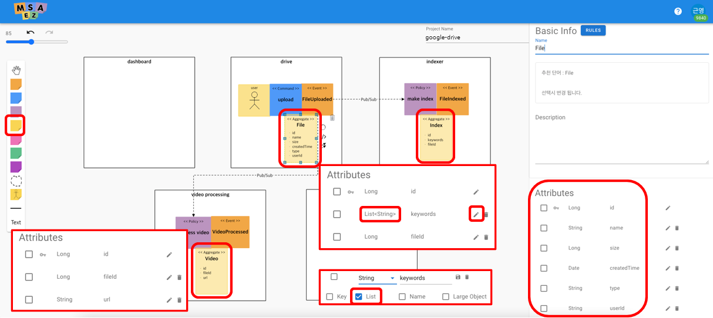
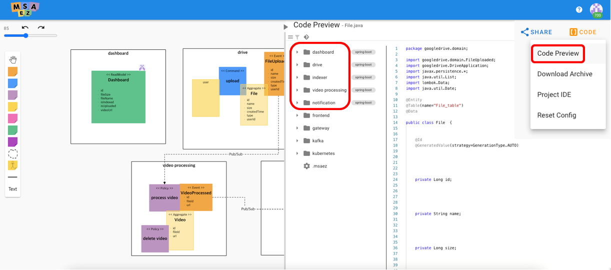
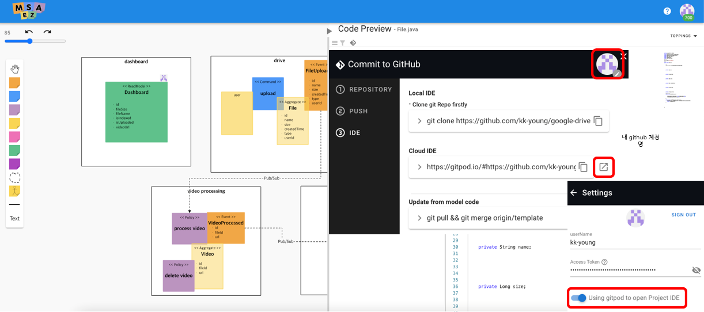
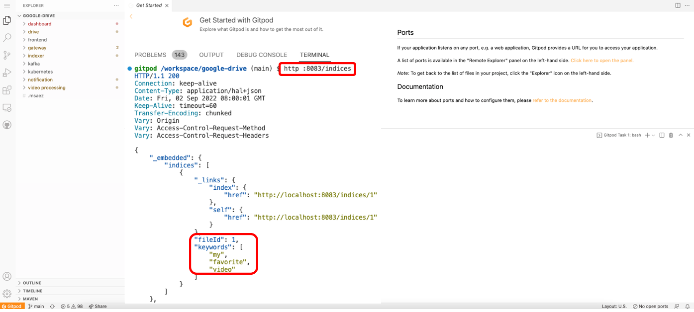
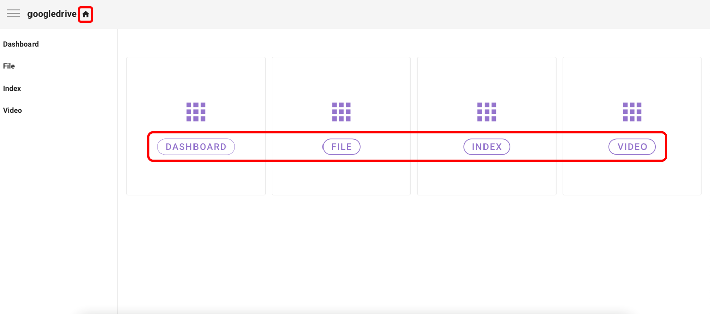
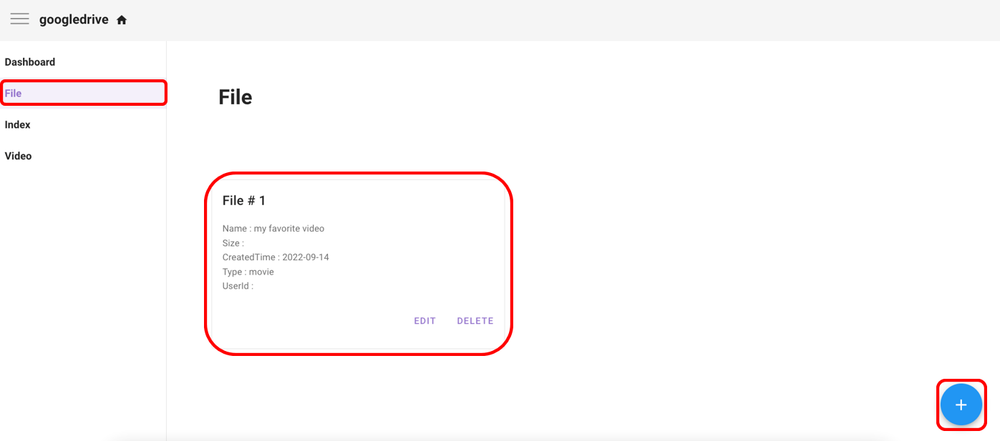
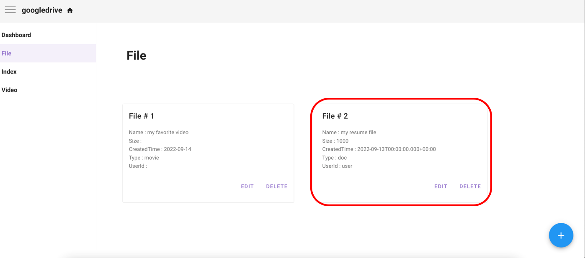
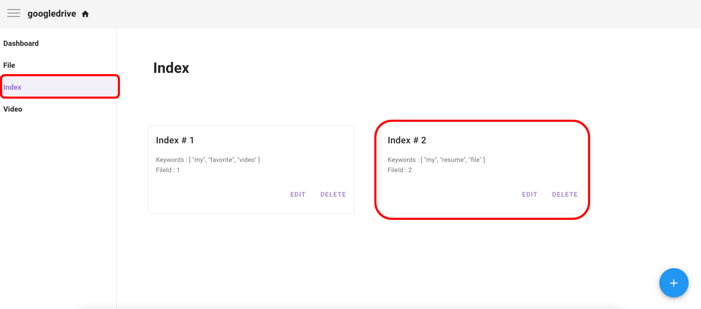
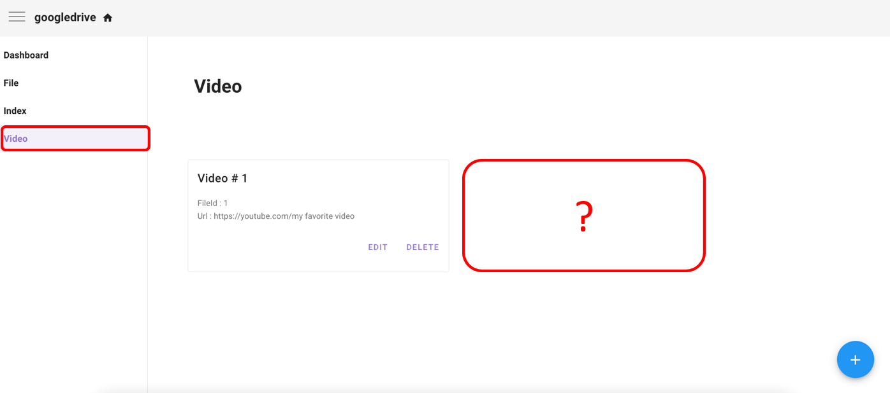

# 구글 드라이브 예제

<h2>마이크로서비스를 기반 구글 드라이브 서비스 개발하기</h2>

## 실습도구 접속
[msaez.io](http://labs.msaez.io) 에 접속합니다.
 (크롬 브라우저 추천)

## 시나리오

1. 사용자가 파일을 업로드한다.
 
2. 파일이 업로드 될 때마다, 파일의 위치를 파일 이름으로 인덱싱한다.
 
3. 업로드된 파일이 비디오인 경우, 파일을 비디오 스트리밍 처리한다 (결과는 비디오 스트림 서비스 접속 url).
 
4. 파일이 업로드 될때와 비디오로 생성되었을 때, 파일을 업로드한 유저에게 노티가 된다.
 
5. 대시보드에서는 업로드 시킨 파일의 상태 (파일사이즈, 파일명, 인덱싱여부, 업로드여부, 비디오url) 가 표시된다.

서비스 구현에 필요한 바운디드 컨텍스트 목록 : 
 
1. dashboard
2. drive
3. indexer
4. video processing
5. notification

## Instructions

### 모델링

<h4>1. EventStorming Model 생성</h4>

> 

위에서 접속한 labs.msaez.io 에서 아래로 스크롤하면 MODELING TOOLS 종류들이 나옵니다. 
이 중 EventStorming Model의 CREATE 버튼을 클릭해 새 모델을 하나 생성해줍니다.

<h4>2. Bounded Context 구분</h4>

> 

<h4>3. Event(오렌지 스티커) 도출</h4>

> 

<h4>4. Event 에 대한 Input 추가</h4>

> 

<h4>5. Aggregate(노란색 스티커) 속성 추가</h4>

> 

<h4>6. Event 속성 추가</h4>

> 

<h4>7. notification Policy 추가</h4>

> 

<h4>8. ReadModel(초록색 스티커) 속성 추가</h4>

> 

<h4>9. ReadModel CREATE WHEN 추가</h4>

> 

<h4>10. ReadModel UPDATE WHEN 추가</h4>

> 

<h4>11. ReadModel UPDATE WHEN 추가</h4>

> 

<h4>12. 완성된 모델로부터 도출된 코드 확인</h4>

> 

<h4>13. git repository 연동</h4>

> 

<h4>14. gitpod IDE 실행</h4>

> 

### 프로젝트 실행

<h4>15. drive 서비스 실행</h4>

> 

<h4>16. kafka 실행</h4>

> 

<h4>17. httpie 설치</h4>

> 

<h4>18. httpie tool 작동 테스트</h4>

> 

<h4>19. index 코드 수정 및 서비스 실행</h4>

> 

<h4>20. 테스트용 파일 업로드</h4>

> 

<h4>21. 업로드된 파일에 대한 indexer 작동 확인</h4>

> 

<h4>22. video 코드 수정 및 서비스 실행</h4>

> 

<h4>23. 업로드된 파일에 대한 video processing 작동 확인</h4>

> 

<h4>24. dashboard 서비스 실행 및 내역 조회</h4>

> 

<h4>25. 프론트엔드 서버 실행</h4>

> 

### 웹 어플리케이션 활용 

<h4>26. 홈 화면</h4>

> 

<h4>27. 대시보드 조회</h4>

> 

<h4>28. 업로드된 파일 목록 조회 + 파일 추가</h4>

> 

<h4>29. 파일 추가 상세</h4>

> 

<h4>30. 새로 업로드한 파일 조회</h4>

> 

<h4>31. 새로 업로드한 파일 index 여부 확인</h4>

> 

<h4>32. 새로 업로드한 파일 video processing 여부 확인</h4>

> 