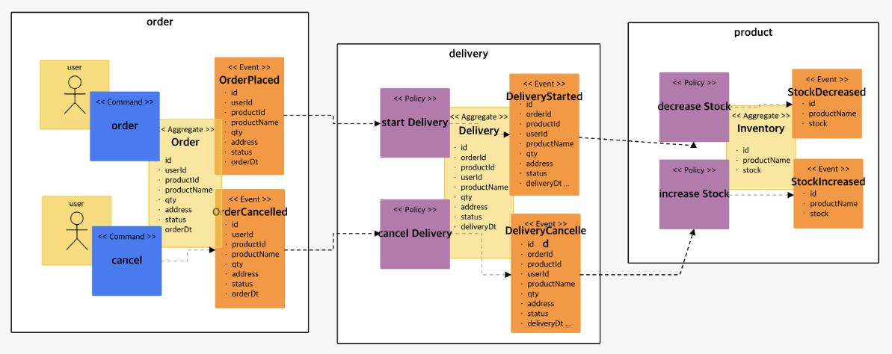
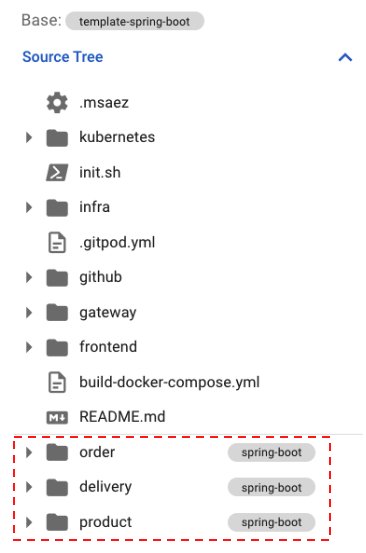
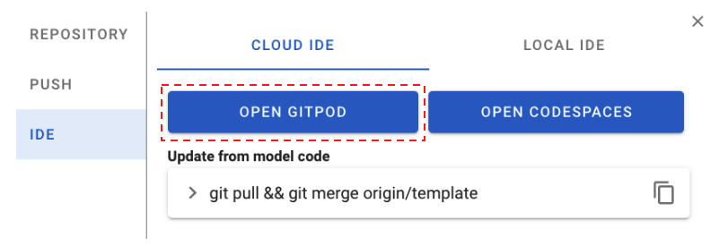
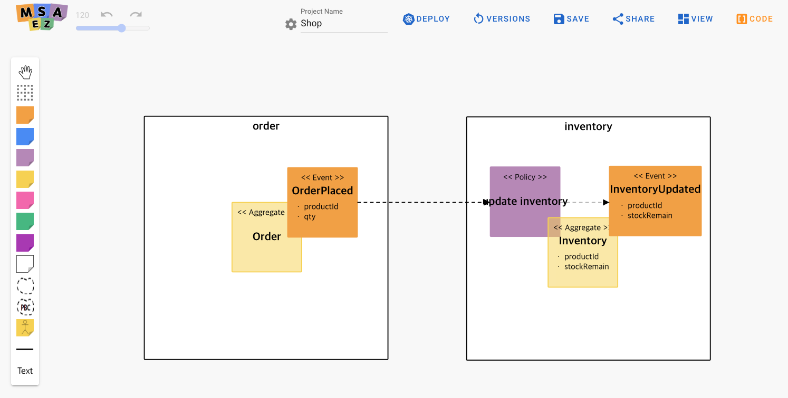
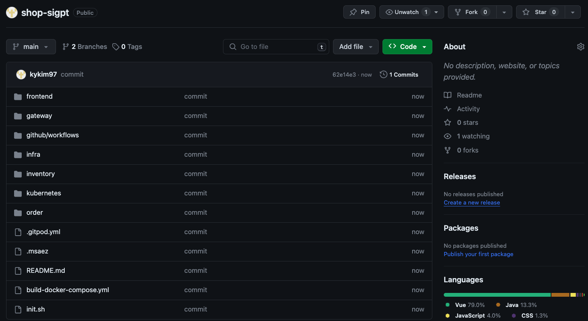
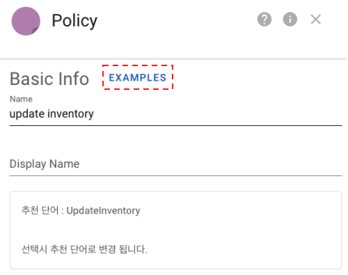
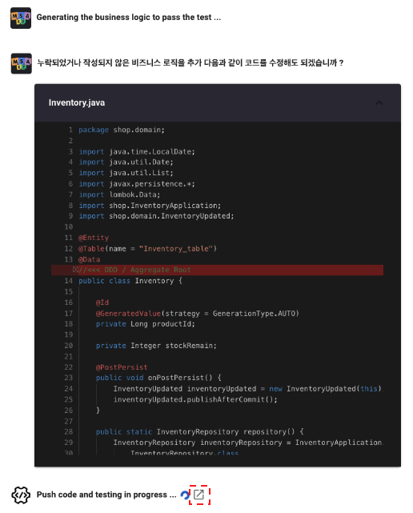
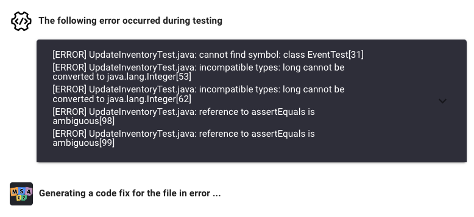

# 코드 생성

이번 세션부터는 이전 과정에서 작성 이벤트스토밍 모델을 활용하여 MSAEZ의 코드 생성 기능 및 다양한 마이크로서비스 패턴들을 자동으로 생성된 코드에 추가하는 내용이 설명됩니다.

먼저, 이전 과정에서 작성된 아래 이벤트스토밍 모델에 대해 MSAEZ가 제공하는 코드 생성 기능을 활용합니다.



## 파일 구조

Bounded Context 에 설정한 이름별(Order, Delivery)로 프로젝트가 생성되고, 아래와 같은 구조를 가집니다.



gateway 는 기본 제공되는 템플릿으로 spring-cloud-gateway를 설정하는 방법을 나타내고 있습니다.
    정상적으로 사용시에는 gateway/src/main/resource 의 application.yaml
    파일에서 routes 부분을 수정하여 사용하여야 합니다.

파일 구조는 아래와 같이 스티커별로 기본 템플릿에 의하여 생성됩니다. spring-boot 기반의 프로젝트 이며, maven 으로 리소스 관리를 합니다. 파일 생성 위치나, 파일 안의 기본 내용을 생성시마다 변경을 하려면 다음 장의 커스텀 템플릿을 활용하면 됩니다.


**application.yaml**
    
- spring-boot 의 설정 파일이며, local 환경 변수와 Docker용 환경변수를 profile 설정으로
        분리했습니다.
    
- 이벤트 기반이기 때문에 메시지 처리를 위하여 spring-cloud-stream 라이브러리를 사용합니다. 그 중에서 브로커를 kafka 를 사용하여 설정되어 있습니다.

**Dockerfile**
    
- Docker image 를 생성할 때 필요한 파일입니다.
    
- Docker 로 build 시 "--spring.profiles.active=docker" 로 설정되어 있어서 application.yaml 파일에서 설정한 프로파일을 읽게 됩니다.

## GitPod Cloud IDE 연동


Code Preview의 Menu Panel에서 Push to Git 버튼을 클릭하면 나오는 다이얼로그의 Create 버튼을 클릭해 본인 GitHub 계정에 New Repository를 생성합니다.


Repository 생성이 완료되면 초록색 success 알림창이 뜨고, Repo 주소 옆에 있는 버튼을 클릭하면 해당 레포지토리로 이동해 프로젝트가 생성된 것을 확인할 수 있습니다.


<p align="center">생성된 Git Repository 화면</p>



Repository 생성 완료가 확인되면 IDE 탭으로 이동해 Open GitPod 버튼을 클릭해 GitPod Cloud IDE를 실행시킵니다.


GitPod에 접근하면 위와 같은 시작 페이지가 나오고, Continue 버튼을 클릭해 작업을 이어가줍니다.


별도의 설치 없이 웹 브라우저 기반으로 로컬 IDE를 운용할 수 있는 GitPod Cloud IDE에 이벤트스토밍을 통해 생성된 코드가 잘 넘어온 것을 확인할 수 있습니다.

해당 IDE를 활용해 구체적 비즈니스 로직을 구현하거나 서비스를 추가하는 등의 개발 작업을 진행할 수 있습니다.
<!-- 
## ChatGPT 기반 구현 및 디버깅 자동화

### 개념


생성된 이벤트스토밍 모델 기반으로 소스코드를 생성하고, ChatGPT에 프롬프트를 보내 해당 코드가 Runnable한 상태가 될 때까지 테스트 및 디버깅을 자동으로 진행하도록 하는 기능입니다. 

기존 개발자의 업무였던 테스트와 디버깅을 AI에게 위임함으로써 비즈니스 전문가의 아이디어 하나만으로 서비스를 구현할 수 있도록 하였습니다.

<div style = "height:400px; object-fit: cover;">
<iframe style = "width:100%; height:100%;" src="https://www.youtube.com/embed/JuCN-bD7Jkk" title="YouTube video player" frameborder="0" allow="accelerometer; autoplay; clipboard-write; encrypted-media; gyroscope; picture-in-picture" allowfullscreen></iframe>
</div><br>

위 데모영상에서 자세한 수행 방법을 확인하실 수 있습니다.
 -->
### 수행 방법





1. 완성된 이벤트스토밍 모델을 저장하고 Git Repository에 Push합니다.




2. 각 Policy 스티커의 속성에서 EXAMPLES 버튼을 클릭해 Given, When, Then에 대한 **Rule**을 추가해줍니다.


3. Rule이 추가된 이후 CODE PREVIEW 창을 열고 해당 Policy가 포함된 마이크로서비스의 최상위 파일을 클릭하면 우측에 테스트 선택 창이 열립니다.


4. 테스트 선택 창을 클릭하면 자동으로 **unit-test** 토핑이 코드에 반영되고, 각 마이크로서비스 파일 내에 test 폴더가 생성됩니다.

```java
UpateInventoryTest.java

@Test
    @SuppressWarnings("unchecked")
    public void test0() {
        //given:
        Inventory entity = new Inventory();

        entity.setProductId(123L);
        entity.setStockRemain(50L);

        repository.save(entity);

        //when:

        OrderPlaced event = new OrderPlaced();

        event.setProductId(123L);
        event.setQty(10L);

        InventoryApplication.applicationContext = applicationContext;

        ObjectMapper objectMapper = new ObjectMapper();
        try {
            String msg = objectMapper.writeValueAsString(event);

            processor
                .inboundTopic()
                .send(
                    MessageBuilder
                        .withPayload(msg)
                        .setHeader(
                            MessageHeaders.CONTENT_TYPE,
                            MimeTypeUtils.APPLICATION_JSON
                        )
                        .setHeader("type", event.getEventType())
                        .build()
                );

            //then:

            Message<String> received = (Message<String>) messageCollector
                .forChannel(processor.outboundTopic())
                .poll();

            assertNotNull("Resulted event must be published", received);

            InventoryUpdated outputEvent = objectMapper.readValue(
                received.getPayload(),
                InventoryUpdated.class
            );

            LOGGER.info("Response received: {}", received.getPayload());

            assertEquals(outputEvent.getProductId(), 123L);
            assertEquals(outputEvent.getStockRemain(), 40L);
        } catch (JsonProcessingException e) {
            // TODO Auto-generated catch block
            assertTrue("exception", false);
        }
    }
```

5. 해당 폴더 내에 있는 테스트 파일을 확인해보면 앞서 Rule을 적용한 given, when, then에 대한 예시값과 테스트를 위한 로직이 생성되어 있습니다.


6. 테스트를 진행할 파일을 선택하고 AUTO IMPLEMENT 버튼을 클릭하면 ChatGPT로 프롬프트가 전송되고 자동 테스트가 진행됩니다.



7. Push code and testing in progress 메시지 옆에 있는 버튼을 클릭하면 Github Actions의 테스트 페이지로 이동해 테스트 현황을 확인할 수 있습니다.




8. 테스트가 실패하면 테스트 실패 원인 및 발생한 오류 로그를 표시하며, 해당 오류를 수정한 코드를 반영하여 자동으로 다시 테스트를 진행합니다.


9. 테스트가 통과되면 Test success 메시지와 함께 Runnable한 소스코드가 반영된 GitPod Cloud IDE로 연결되는 버튼이 나타납니다.

해당 버튼을 클릭해 비즈니스 로직 구현 등의 개발 작업을 진행하거나 곧바로 서비스 배포 작업을 시작할 수 있습니다.