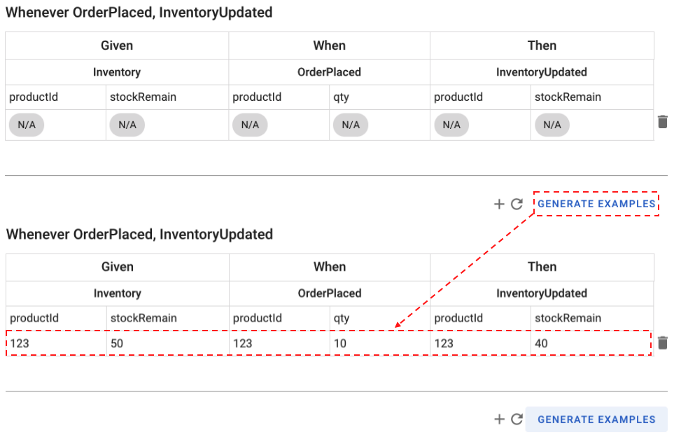
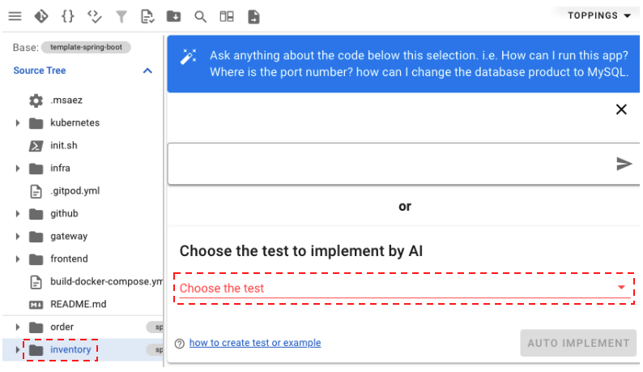
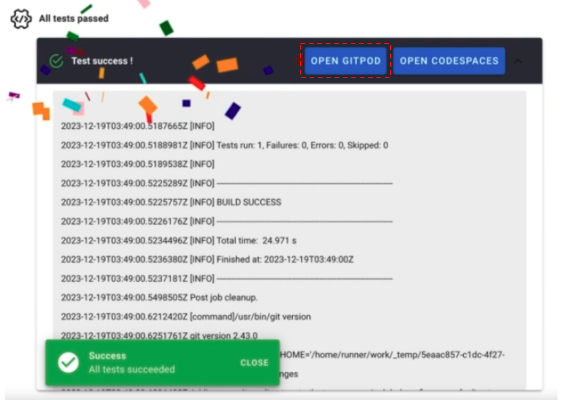

<div class="code-block">

# AI 기반 구현 및 디버깅 자동화

<div class="video-container">
	<iframe src="https://www.youtube.com/embed/JuCN-bD7Jkk" frameborder="0" crolling="no" frameborder="none" allowfullscreen=""></iframe>
</div>
<br>
<h2>Open AI 기술을 활용한 단위테스트 및 디버깅</h2>


생성된 이벤트스토밍 모델 기반으로 소스코드를 생성하고, ChatGPT에 프롬프트를 보내 해당 코드가 Runnable한 상태가 될 때까지 테스트 및 디버깅을 자동으로 진행하도록 하는 기능입니다. 

기존 개발자의 업무였던 테스트와 디버깅을 AI에게 위임함으로써 비즈니스 전문가의 아이디어 하나만으로 서비스를 구현할 수 있도록 하였습니다.

위 데모영상에서 자세한 수행 방법을 확인하실 수 있습니다.

## 수행 방법


1. 완성된 이벤트스토밍 모델을 저장하고 Git Repository에 Push합니다.




2. 각 Policy 스티커의 속성에서 EXAMPLES 버튼을 클릭해 Given, When, Then에 대한 **Rule**을 추가해줍니다.



3. Rule이 추가된 이후 CODE PREVIEW 창을 열고 해당 Policy가 포함된 마이크로서비스의 최상위 파일을 클릭하면 우측에 테스트 선택 창이 열립니다.


4. 테스트 선택 창을 클릭하면 자동으로 **unit-test** 토핑이 코드에 반영되고, 각 마이크로서비스 파일 내에 test 폴더가 생성됩니다.


```java
@Test
    @SuppressWarnings("unchecked")
    public void test0() {
        //given:
        Inventory entity = new Inventory();

        entity.setProductId(123L);
        entity.setStockRemain(50L);

        repository.save(entity);

        //when:

        OrderPlaced event = new OrderPlaced();

        event.setProductId(123L);
        event.setQty(10L);

        InventoryApplication.applicationContext = applicationContext;

        ObjectMapper objectMapper = new ObjectMapper();
        try {
            String msg = objectMapper.writeValueAsString(event);

            processor
                .inboundTopic()
                .send(
                    MessageBuilder
                        .withPayload(msg)
                        .setHeader(
                            MessageHeaders.CONTENT_TYPE,
                            MimeTypeUtils.APPLICATION_JSON
                        )
                        .setHeader("type", event.getEventType())
                        .build()
                );

            //then:

            Message<String> received = (Message<String>) messageCollector
                .forChannel(processor.outboundTopic())
                .poll();

            assertNotNull("Resulted event must be published", received);

            InventoryUpdated outputEvent = objectMapper.readValue(
                received.getPayload(),
                InventoryUpdated.class
            );

            LOGGER.info("Response received: {}", received.getPayload());

            assertEquals(outputEvent.getProductId(), 123L);
            assertEquals(outputEvent.getStockRemain(), 40L);
        } catch (JsonProcessingException e) {
            // TODO Auto-generated catch block
            assertTrue("exception", false);
        }
    }
</div>
```

5. 해당 폴더 내에 있는 테스트 파일을 확인해보면 앞서 Rule을 적용한 given, when, then에 대한 예시값과 테스트를 위한 로직이 생성되어 있습니다.


6. 테스트를 진행할 파일을 선택하고 AUTO IMPLEMENT 버튼을 클릭하면 ChatGPT로 프롬프트가 전송되고 자동 테스트가 진행됩니다.


7. Push code and testing in progress 메시지 옆에 있는 버튼을 클릭하면 Github Actions의 테스트 페이지로 이동해 테스트 현황을 확인할 수 있습니다.


8. 테스트가 실패하면 테스트 실패 원인 및 발생한 오류 로그를 표시하며, 해당 오류를 수정한 코드를 반영하여 자동으로 다시 테스트를 진행합니다.



9. 테스트가 통과되면 Test success 메시지와 함께 Runnable한 소스코드가 반영된 GitPod Cloud IDE로 연결되는 버튼이 나타납니다.

해당 버튼을 클릭해 비즈니스 로직 구현 등의 개발 작업을 진행하거나 곧바로 서비스 배포 작업을 시작할 수 있습니다.

<style>
    /* 해당 코드 블록의 너비를 조절합니다. */
    .code-block {
        overflow-x: auto;
    }
</style>